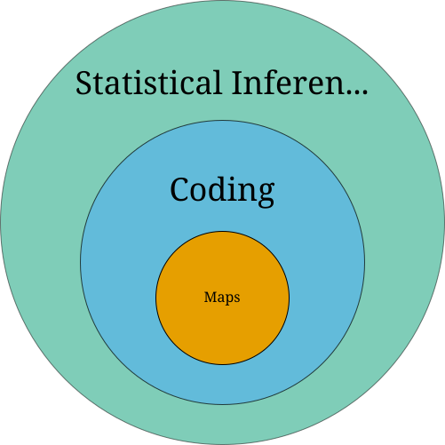
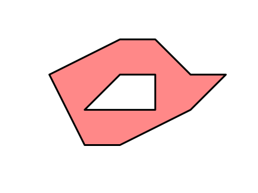
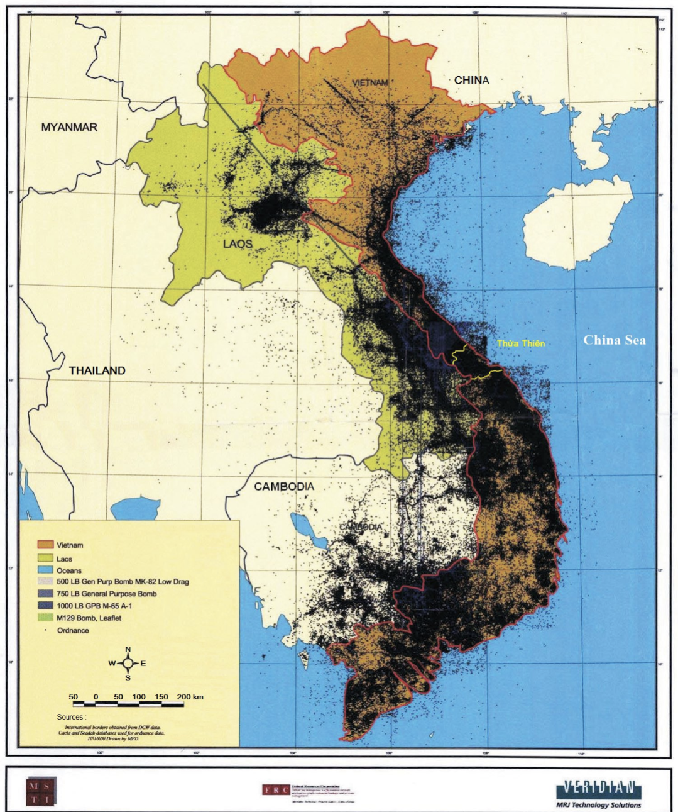
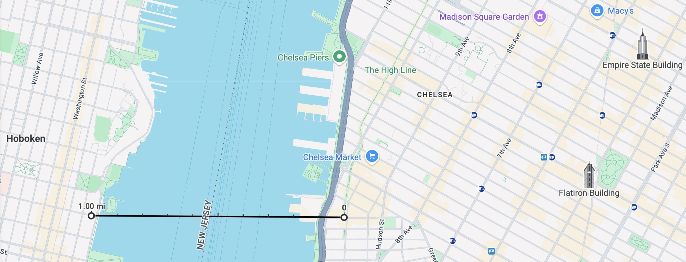
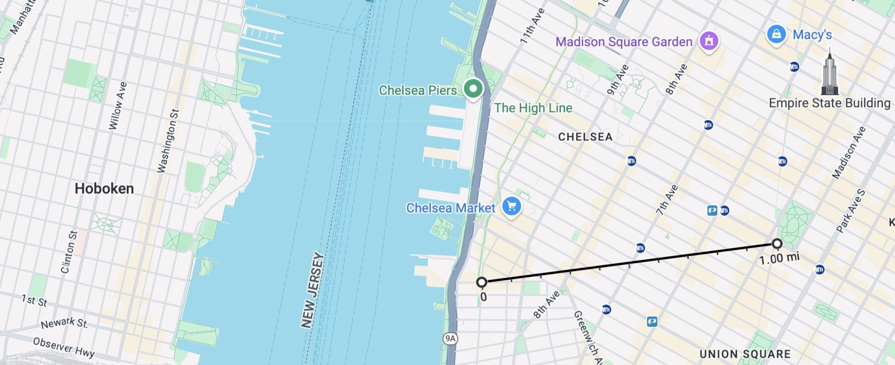
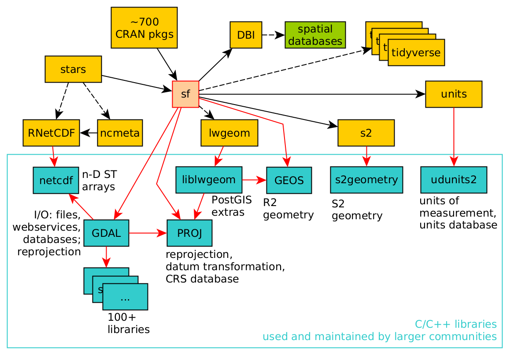

::: {.content-visible unless-format="revealjs"}

<center class='mb-3'>
<a class="h2" href="./slides.html" target="_blank">Open slides in new tab &rarr;</a>
</center>

:::

# Welcome to The Wonderful World of GIS! {data-stack-name="Welcome!" .title-08}

<!-- * **Unit 1**: Maps
* **Unit 2**: Maps + Coding
* **Unit 3**: Data Science/Statistics/Econometrics with Maps
  * Drawing inferences about spatial phenomena using coding
* **Unit 4**: Applying Units 1-3 to Issues in the World! -->

{fig-align="center" width="90%"}

## Your Final Project {background-color="black" background-image="images/goku_final.jpeg" background-size="100%" background-repeat="no-repeat" .title-center}

## Unit 1: Maps {.smaller .crunch-title .crunch-ul .smaller-table .crunch-li}

::: {.hidden}

```{r}
#| label: r-source-globals
source("../dsan-globals/_globals.r")
```

:::

* Your least favorite part of the course (per survey 😜)
* My favorite part of the course (because I love overthinking things)
* My goal given survey results: Let's think of this unit like learning **languages** for expressing **spatial** information:

```{r}
#| label: gen-polygon
#| output: false
library(sf)
library(svglite)
svglite("images/st_polygon.svg", width = 6, height = 4.5)
poly_blob <- st_polygon(
  list(
    rbind(c(2,1), c(3,1), c(5,2), c(6,3), c(5,3), c(4,4), c(3,4), c(1,3), c(2,1)),
    rbind(c(2,2), c(3,3), c(4,3), c(4,2), c(2,2))
  )
)
plot(poly_blob,
  border = 'black', col = '#ff8888', lwd = 4
)
dev.off()
```

| Temporal Information | Spatial Information |
|:-:|:-:|
| {width="200"} | {fig-align="center" width="100%" height="200"} |
| $\Rightarrow$ `22.5 seconds` | $\Rightarrow$ `POLYGON ((2 1, 3 1, 5 2, 6 3, 5 3, 4 4, 3 4, 1 3, 2 1),(2 2, 3 3, 4 3, 4 2, 2 2))` |

: {tbl-colwidths="[50,50]"}

* I think you'll be surprised at how, complexity of geospatial/spatio-temporal data $\implies$ need for **programming-language-independent** representations

## Unit 2: Using Code to Make Maps

* (More on this in Prereqs section below!)
* Given representations from Part 1, the task of coding becomes task of **finding "best" library for loading/manipulating/plotting them**
  * Where "best" = best for **you!**
* In **R**: `sf` and friends (`tidyverse`)
* In **Python**: `geopandas`

## Unit 3: Spatial Data Science

* Drawing **inferences** about spatial phenomena
* The meat of the course
* How can we write code (Unit 2) to analyze a map (Unit 1) so as to...
  * **Discover** patterns (EDA: Exploratory Data Analysis) or
  * **Test** hypotheses (CDA: Confirmatory Data Analysis)

## Unit 4: Applications / Final Project

* Take everything you've learned in Units 1-3 and use them to learn something about the world!
* Public Policy: Which counties are most in need of more transportation infrastructure?
* Urban Planning: Which neighborhoods are most in need of a new bus stop?
* Epidemiology: What properties of a region make it more/less susceptible to infectious diseases? Where should we **intervene** to "cut the chain" of a disease vector?

## Who Am I? Why Am I Teaching You? {.crunch-title}

* Started out as PhD student in **Computer Science**
  * UCLA: Algorithmic Game Theory
  * Stanford (MS): Economic Network Analysis
* Ended up with PhD in **Political Economy**
  * Columbia: "Computational Political Theory"

## My GIS Adventures

* High school project: **mine defusal** in Indochina
* As a **Telecommunications Engineer** for Huawei (HKUST)
* As an **Urban Economist** at UC Berkeley
  * Used, e.g., Google Maps API to evaluate effects of [**Suburbanization of Poverty**](https://www.brookings.edu/wp-content/uploads/2016/06/0120_poverty_paper.pdf){target='_blank'}

## My GIS 🤯 Moment {.crunch-title .crunch-ul .crunch-li-8}

:::: {.columns}
::: {.column width="50%"}

* Horrors of "Vietnam War" did not end in 1975...
* Casualties from unexploded ordnance (cluster bombs) continue to devastate the region, over 220,000 victims:
  * [>105K in Vietnam](https://www.baldwin.senate.gov/imo/media/doc/Legacies%20of%20War%20Recognition%20and%20UXO%20Removal%20Act.pdf){target='_blank'}
  * [>50K in Laos](https://www.cnn.com/2016/09/05/asia/united-states-laos-secret-war/index.html){target='_blank'}
  * [>65K in Cambodia](https://apnews.com/article/bombs-land-mines-unexploded-ordnance-demining-564f0203aeb53aa95118a1396b907246){target='_blank'}

:::
::: {.column width="50%"}

{fig-align="center" width="80%"}

:::
::::

## Huawei: Optimizing Cell Tower Placement {.smaller .title-12}

{target='_blank'}* [&nbsp;](https://www.youtube.com/watch?v=5W-ufw5Z7ac){target='_blank'}](images/mimo.jpeg){fig-align="center"}

## The Suburbanization of Poverty

* Since 2008, a person living in poverty in the US is more likely to be in a **suburb** than an "inner city"
* What does this mean for...
  * **Access to Food / Public Services?**
  * **Finding a job $\leadsto$ Commuting?**
* My job: computing "suburban accessibility indices"
* Does commuting = straight line distance?

## "Distance" vs. Distance! {.smaller .crunch-title .crunch-ul .crunch-quarto-figure .crunch-p .crunch-img}

You've just been hired as a fine art curator at [The Whitney](https://en.wikipedia.org/wiki/Whitney_Museum){target='_blank'}... Congratulations!

```{=html}
<table>
<colgroup>
<col style="width: 25%;">
<col style="width: 75%;">
</colgroup>
<thead>
</thead>
<tbody>
<tr>
  <td class='tdvc tdc'><i>Commuting 1 mile to the Whitney</i></td>
  <td><span data-qmd="{fig-align='center' width='85%'}"></span></td>
</tr>
<tr>
  <td class='tdvc tdc'><i>Also commuting 1 mile to the Whitney</i></td>
  <td><span data-qmd="{fig-align='center' width='85%'}"></span></td>
</tr>
</tbody>
</table>
```

## The Spatial Data Science Universe {.smaller}

{fig-align="center"}

* We'll cover key pieces: <i class='bi bi-1-circle'></i> [GDAL](https://gdal.org/index.html){target='_blank'} (Geospatial Data Abstraction Library), <i class='bi bi-2-circle'></i> [PROJ](https://proj.org/en/9.4/){target='_blank'} to convert between projections, <i class='bi bi-3-circle'></i> [GEOS](https://libgeos.org/){target='_blank'} for computational geometry

# Why Should You Care About GIS? {data-stack-name="Why GIS?"}

* As a Human
* As a Data Scientist
* As a Public Policy Expert

## As Humans {.smaller .crunch-title .crunch-ul .crunch-img .crunch-quarto-figure}

* To understand the world around you!

{target='_blank'} (1826)](images/dupin.jpg){fig-align="center"}

* $\implies$ Crucial landmark in the [**genesis of social science**](https://read.dukeupress.edu/french-historical-studies/article-abstract/33/2/307/9657/Charles-Tilly-s-Vende-e-as-a-Model-for-Social?redirectedFrom=PDF){target='_blank'}

## As Data Scientists {.crunch-ul .crunch-title .crunch-blockquote}

* All data scientists are expected to know how to analyze "standard" types of data: tabular, numeric data (think spreadsheets)
* However, you can **differentiate yourself** in the scary scary job market by developing a particular focus on some "non-standard" type:

> *Hello Mrs. Google Meta OpenAI, yes, indeed, I have a wealth of experience working with [**text** data / **temporal** data / **signal** processing / **geospatial** data]. This job will be no problem for me.*

## As Public Policy Experts {.smaller .crunch-title .crunch-ul .crunch-quarto-figure}

* Oftentimes, all it takes is one map to see why a policy has failed 😱

{target='_blank'})](images/dc_racial_dot_map.png){fig-align="center"}

::: {.notes}

http://www.radicalcartography.net/index.html?chicagodots, then adapted to DC: "[Eric Fisher] was astounded by Bill Rankin's map of Chicago's racial and ethnic divides</a> and wanted to see what other cities looked like mapped the same way. To match his map, Red is White, Blue is Black, Green is Asian, Orange is Hispanic, Gray is Other, and each dot is 25 people. Data from Census 2000. Base map © OpenStreetMap, CC-BY-SA" https://commons.wikimedia.org/wiki/File:Race_and_ethnicity_map_of_Washington,_D.C..png

:::

## References

::: {#refs}
:::