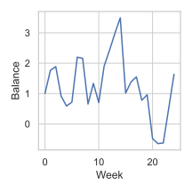
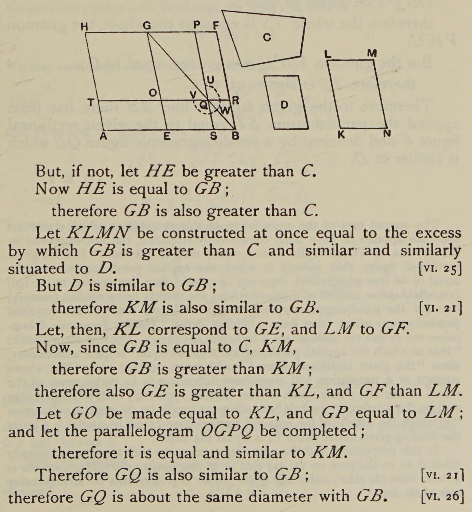
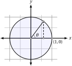
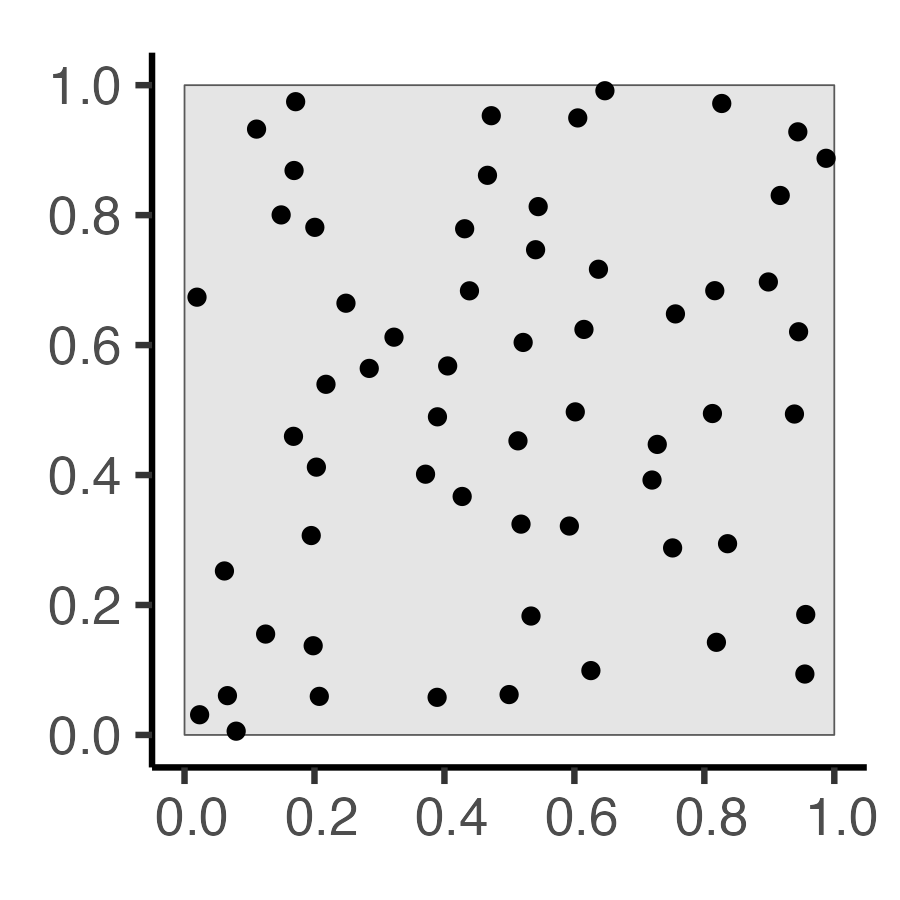
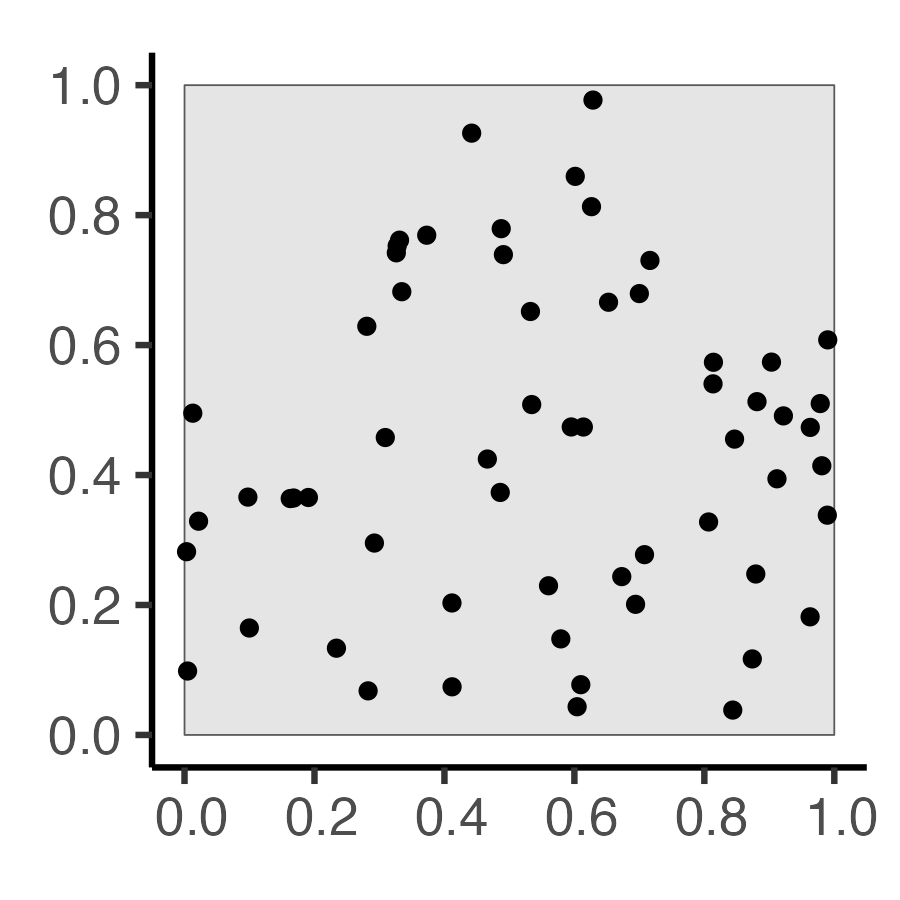
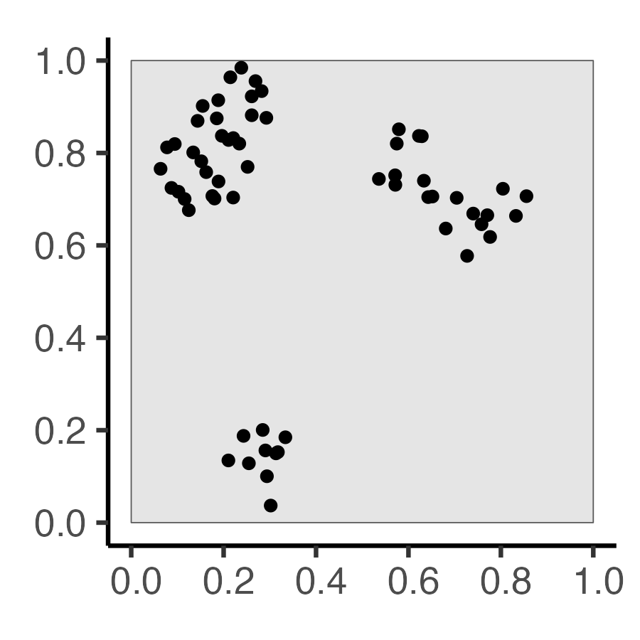
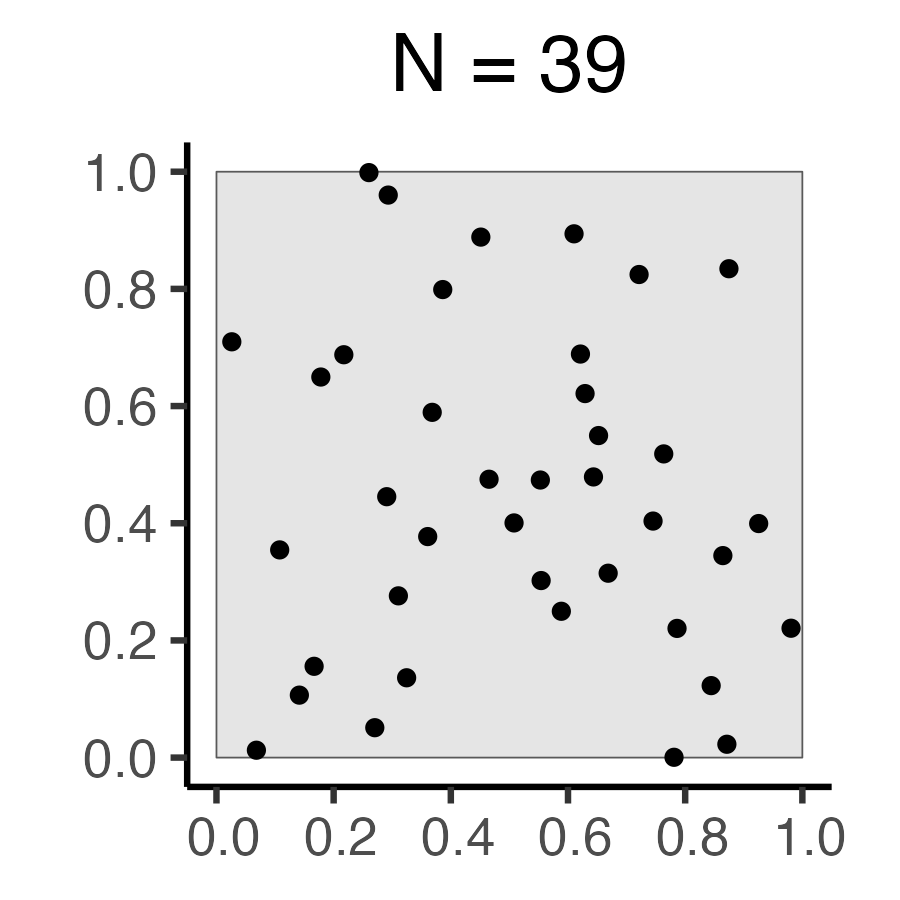
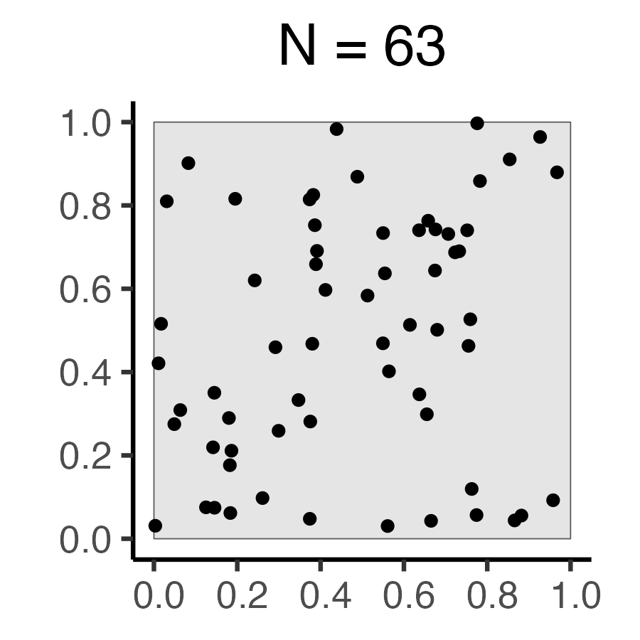
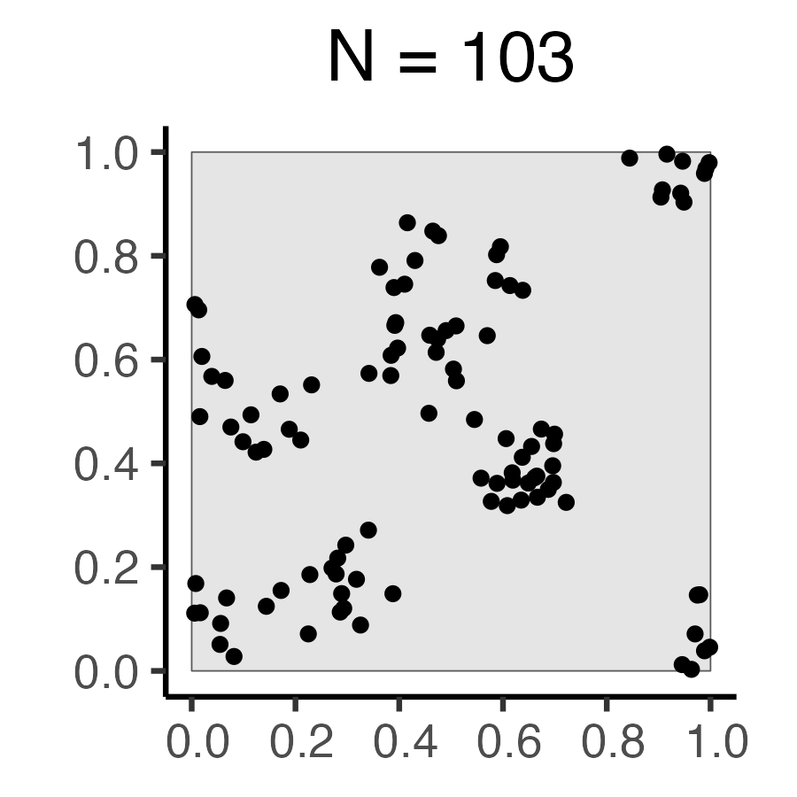

::: {.content-visible unless-format="revealjs"}

<center class='mb-3'>
<a class="h2" href="./slides.html" target="_blank">Open slides in new tab &rarr;</a>
</center>

:::

# Schedule {.smaller .small-title .crunch-title .crunch-callout data-name="Schedule"}

Today's Planned Schedule:

| | Start | End | Topic |
|:- |:- |:- |:- |
| **Lecture** | 6:30pm | 7:00pm | [Logistics 1: Positron &rarr;](#logistics-1-positron) |
| | 6:50pm | 7:15pm | [Logistics 2: Reducing Fear &rarr;](#model-selection) | 
| | 7:20pm | 7:50pm | [Building Our First Map! &rarr;](#lets-make-some-dang-maps) |
| **Break!** | 7:50pm | 8:00pm | |
| | 8:00pm | 8:30pm | [Raster Data &rarr;](#raster-data) |
| | 8:30pm | 9:00pm | [Finding GIS Data &rarr;](#finding-gis-data) |

: {tbl-colwidths="[12,12,12,64]"}

::: {.hidden}

```{r}
#| label: r-source-globals
source("../dsan-globals/_globals.r")
set.seed(6805)
```

:::



# Logistics 1: Positron {data-stack-name="Logistics"}

* For doing **HW1**, now released!

## GIS as an "Umbrella Term" {.smaller .crunch-title .crunch-ul}

* **Libraries** and **tools** we'll use: **specific** systems/methods for geospatial analysis
* **GIS** is an "umbrella term", which just vaguely refers to this entire universe of libraries/tools/techniques/approaches

```{=html}
<table>
<colgroup>
  <col style="width: 20%;">
  <col style="width: 40%;">
  <col style='width: 40%'>
</colgroup>
<thead>
<tr>
  <th class="tdc">Umbrella Term</td>
  <th class='tdc'>Concepts</td>
  <th class="tdc">Specific Skills</td>
</tr>
</thead>
<tbody>
<tr>
  <td class="tdc"><b>Coding</b></td>
  <td><div data-qmd="* Variables
* Control Flow
* Algorithms"></div></td>
  <td><div data-qmd="* Python
* R
* JavaScript"></div></td>
</tr>
<tr>
  <td class='tdc'><b>GIS</b></td>
  <td><div data-qmd="* Projections
* Vector vs. Raster
* Spatial Data Formats (shapefiles, `.geojson`)"></div></td>
  <td class='tdvc'><div data-qmd="* ArcGIS
* GeoPandas (Python)
* [`sf`](https://r-spatial.github.io/sf/){target='_blank'} (R)"></div></td>
</tr>
</tbody>
</table>
```

## ArcGIS... {.crunch-title .crunch-ul}

* For info on Georgetown's provision of ArcGIS (Online, Pro, and Desktop), see the [Library Guide](https://guides.library.georgetown.edu/esri_software){target='_blank'}

{target='_blank'} (see [CDTO talk](https://jjacobs.me/data-ethics-cdto))](images/arcgis.jpg)

## Then... Why Can't We Just Use ArcGIS? {.crunch-title .title-12 .smaller .unindent-lists .tdvt-all .crunch-p .text-65}

Analogy from **non**-geospatial data science:

<!-- | Text Files | &rarr; | Spreadsheets | &rarr; | Equations | &rarr; | Code |
| - |:-:| - |:-:| - |:-:| - |
| <ul><li>Start entering information</li><li>2</li></ul> | |  | d | e | f | g |

: {tbl-colwidths="[22,4,22,4,22,4,22]"} -->

```{=html}
<style>
.border-all {
  font-size: 70% !important;
}
.border-all td, .border-all th {
  border: 1px solid black !important;
}
</style>
<table>
<colgroup>
  <col style="width: 24%;">
  <col style="width: 1.2%;">
  <col style="width: 24%;">
  <col style="width: 1.2%;">
  <col style="width: 24%;">
  <col style="width: 1.2%;">
  <col style="width: 24%;">
</colgroup>
<thead>
<tr>
  <th align="center">Text<br><i>Drawn Map</i></th>
  <th align="center" style='vertical-align: middle;'>&rarr;</th>
  <th align="center">Speadsheet<br><i style='font-size: 80%'>Digital Map</i></th>
  <th align="center" style='vertical-align: middle;'>&rarr;</th>
  <th align="center">Equations<br><i>Maps w/ArcGIS</i></th>
  <th align="center" style='vertical-align: middle;'>&rarr;</th>
  <th align="center">Code<br><i>This Class</i></th>
</tr>
</thead>
<tbody>
<tr>
  <td colspan="2">
    <span data-qmd="<i class='bi bi-1-circle'></i> Start writing"></span>
    
    <div data-qmd="``` {filename='info.txt'}
I gave Ana $3, then Ana paid me back $2. [...]
```"></div>
    
    <span data-qmd="<i class='bi bi-2-circle'></i> Realize there's regularity/structure 🤔"></span>
  </td>
  <td colspan="2">
    <span data-qmd="<i class='bi bi-1-circle'></i> Start entering info in rows"></span>
    <table class="border-all">
    <thead>
    <tr>
      <th>Fr</th>
      <th>To</th>
      <th>Amt</th>
      <th>Bal</th>
    </tr>
    </thead>
    <tbody>
    <tr>
      <td>Me</td>
      <td>Ana</td>
      <td>$3</td>
      <td>-$3</td>
    </tr>
    <tr>
      <td>Ana</td>
      <td>Me</td>
      <td>$2</td>
      <td>-$1</td>
    </tr>
    </tbody>
    </table>
    <span data-qmd="<i class='bi bi-2-circle'></i> Realize you're manually computing things that could be automated 🤔"></span>
  </td>
  <td colspan="2">
    <span data-qmd="<i class='bi bi-1-circle'></i> Start using equations"></span>
    <table class="border-all">
    <thead>
    <tr>
      <th>Fr</th>
      <th>To</th>
      <th>Amt</th>
      <th>Bal</th>
    </tr>
    </thead>
    <tbody>
    <tr>
      <td>Me</td>
      <td>Ana</td>
      <td>$3</td>
      <td><span data-qmd="`=0-C1`"></span></td>
    </tr>
    <tr>
      <td>Ana</td>
      <td>Me</td>
      <td>$2</td>
      <td><span data-qmd="`=D1-C2`"></span></td>
    </tr>
    </tbody>
    </table>
    <span data-qmd="<i class='bi bi-2-circle'></i> Realize you need fancier equations, and/or need to coordinate with inputs (APIs), outputs (plotting libraries) 🤔"></span>
  </td>
  <td>
    <div data-qmd="<i class='bi bi-1-circle'></i> Write code"></div>

    <div data-qmd="``` {.python filename='plot_balance.py'}
import pandas as pd
df = pd.read_csv(...)
calc_weekly_balance()
df.plot()
```"></div>
  <!-- </img> -->
  </img>
  <div data-qmd="<i class='bi bi-2-circle'></i> Profit 💲💰🤑💰💲"></div>
  </td>
</tr>
</tbody>
</table>
```

# Course Policy Things {data-stack-name="Prereqs / Policies"}

* How To Not Be Scared of Prerequisites
* AI Things
* Learning How To Learn

## Pedagogical Principles {.crunch-title .crunch-ul .crunch-li .crunch-blockquote}

* There's literally [no such thing as "intelligence"](http://bactra.org/weblog/523.html){target='_blank'}
* Anyone is capable of learning anything (neural plasticity)
* [Growth mindset](https://muse.jhu.edu/article/793356): "I can't do this" $\leadsto$ "I can't do this **yet**!"
* The point of a class is **learning**: understanding something about the world, either (a) For its own sake (**end in itself**) or (b) Because it's relevant to something you care about (**means to an end**)

::: {.text-90}

> Our teaching should be governed, not by a desire to **make** students learn things, but by the endeavor to keep burning within them that light which is called **curiosity**. [@montessori_spontaneous_1916]

:::

## AI and Whatnot {.crunch-title .crunch-ul .smaller}

* If you feel like AI things will help you learn something in the course, then **use them**!
* If you feel like you're using them as a "crutch", try to hold yourself accountable for **not** using it!

```{=html}
<table>
<thead>
<tr>
  <th>Take the time/energy you're using to worry about...</th>
  <th>Use it instead to worry about...</th>
</tr>
</thead>
<tbody>
<tr>
  <td><ul><li>AI Policies</li><li>Collaboration Policies</li><li>Plagiarism</li></ul></td>
  <td align="center" style="vertical-align: middle;">Learning GIS</td>
</tr>
</tbody>
</table>
```

## On Not Worrying About Prereqs {.crunch-title .crunch-li .text-85}

* I genuinely believe that I can make the course accessible to you, meeting you **wherever you're at**, no matter what!
* Everyone learns at their own pace (who says 14 weeks is "correct" amount of time to learn GIS?), and I structure my courses as best as I possibly can to adapt to your pace
* $\Rightarrow$ Assessments (HW, Midterm) valuable in two ways:
* **[Valuable for you]** As an **accountability mechanism** to make sure you're learn the material (how do we know when we've learned something? When we can answer questions about it / use it to accomplish things!)
* **[Valuable for me]** For **assessing and updating** pace

## R and/or Python and/or JS {.smaller .crunch-title .crunch-ul .crunch-p .crunch-img .crunch-li .crunch-quarto-figure .crunch-math .text-65}

* My Geometry vs. Algebra Rant... Euclid's *Elements*, Book VI, Proposition 28.
* The problem: *Divide a given straight line so that the rectangle contained by its segments may be equal to a given area, not exceeding the square of half the line.*

::: {.columns}
::: {.column width="50%"}

[Geometers]{.cb1} solved w/[**geometry**]{.cb1} (300 BC)...

{fig-align="center" width="75%"}

:::
::: {.column width="50%"}

...[Algebraists]{.cb2} solved w/[**algebra**]{.cb2} (2000 BC)...

$$
\begin{align*}
&ax^2 + bx + c = 0 \\
\Rightarrow \; & x_+ = \frac{-b + \sqrt{b^2 - 4ac}}{2a}
\end{align*}
$$

...[From 1637 onwards](https://en.wikipedia.org/wiki/Cartesian_coordinate_system#History), **[w]{.cb1}[h]{.cb2}[i]{.cb1}[c]{.cb2}[h]{.cb1}[e]{.cb2}[v]{.cb1}[e]{.cb2}[r]{.cb1} [i]{.cb2}[s]{.cb1} [e]{.cb2}[a]{.cb1}[s]{.cb2}[i]{.cb1}[e]{.cb2}[r]{.cb1}!** 🤯🤯🤯 (*Isomorphism*)

:::: {#fig-descartes}
::: {.columns}
::: {.column width="48%"}

{fig-align="center" width="70%"}

:::
::: {.column width="48%"}

{fig-align="center" width="100%"}

:::
:::

**Circle with radius 1**? Or $(x,y)$ satisfying $x^2 + y^2 = 1$?
::::

:::
:::

## Learning How To Learn {.smaller .crunch-title .crunch-p}

::: {#fig-lilwayne}



From [The Carter (Documentary)](https://en.wikipedia.org/wiki/The_Carter){target='_blank'}
:::

## He's Literally Extremely Correct! {.smaller}

{target='_blank'}*](images/forgetting-curve.png){fig-align="center"}

# Let's Make Some Dang Maps! {data-stack-name="First Maps"}

## Our First Map: Polygons! {.smaller}

```{r}
#| label: load-dc-sf
#| echo: true
#| code-fold: show
library(tidyverse)
library(rmarkdown)
library(sf)
# Load DC tracts data
dc_sf_fpath <- "data/DC_Census_2020/Census_Tracts_in_2020.shp"
dc_sf <- st_read(dc_sf_fpath);
cols_to_keep <- c(
  "OBJECTID", "TRACT", "GEOID", "ALAND", "AWATER",
  "STUSAB", "SUMLEV", "GEOCODE", "STATE", "NAME",
  "POP100", "HU100", "geometry"
)
dc_sf <- dc_sf |> select(cols_to_keep)
```

## `sf` Objects {.smaller .crunch-title .crunch-p}

`dc_sf` is an R [object]{.boxed-g} of type `sf` (short for **"simple features"**), which extends [`data.frame`]{.boxed-g} by adding a **special column** named [`geometry`]{.boxed-g} (containing **`POLYGON`**s)

```{r}
#| label: dc-sf-properties
#| echo: true
class(dc_sf)
dim(dc_sf)
rmarkdown::paged_table(dc_sf, options=list(rows.print=6))
```

## What Are These `POLYGON` Objects? {.smaller}

```{r}
#| label: disp-polygons
#| echo: true
#| code-fold: show
head(dc_sf)
```

## Zoom... Enhance... {.smaller}

:::: {.columns}
::: {.column width="50%"}

<i class='bi bi-1-circle'></i> Let's try printing just the first row?

```{r}
#| label: disp-first-row
#| echo: true
#| code-fold: show
rmarkdown::paged_table(dc_sf[1,])
```

:::
::: {.column width="50%"}

<i class='bi bi-2-circle'></i> Printing the special `geometry` column?

```{r}
#| label: disp-first-poly
#| echo: true
#| code-fold: show
rmarkdown::paged_table(dc_sf[1, "geometry"])
```

:::
::::

:::: {.columns}
::: {.column width="50%"}

<i class='bi bi-3-circle'></i> Nope, we'll have to **open the "black box"** using the [`st_coordinates()` function](https://r-spatial.github.io/sf/reference/st_coordinates.html) from the `sf` library &rarr;

:::
::: {.column width="50%"}

```{r}
#| label: open-poly-box
#| echo: true
#| code-fold: show
sf::st_coordinates(dc_sf[1,"geometry"])
```

:::
::::

## Working With `sf` Objects {.smaller}

```{r}
#| label: dc-sf-select
#| echo: true
#| code-fold: show
head(dc_sf$NAME) # Select column by name  
head(dc_sf[,4]) # Select column by number
```

## And... Actually Displaying the Map! {.smaller .crunch-quarto-figure .title-12}

```{r}
#| label: dc-sf-display
#| echo: true
#| code-fold: show
#| fig-align: center
# We can extract the geometry with the st_geometry function
dc_geo <- st_geometry(dc_sf)

# Plot the geometry with base R's plot() function
plot(dc_geo)
```

## And with `ggplot`! {.crunch-title}

```{r}
#| label: dc-map-ggplot
#| fig-align: center
dc_sf |>
  ggplot() +
  geom_sf() +
  theme_classic()
```

# Looking Ahead: Types of Geospatial Data {data-stack-name="Datatypes"}

## Key Notation / Definition {.smaller .smaller-table .crunch-title .crunch-ul .crunch-math .text-65}

::: {#full-defn style="width: 100% !important"}

* 2-Dimensional "Spatial Process" [@schabenberger_statistical_2004, 6]

$$
\text{Data} = \left\{Z(\mathbf{s}) \mid \mathbf{s} \in D \subset \mathbb{R}^2\right\}
$$

:::

```{=html}
<table>
<colgroup>
  <col style="width: 9%;">
  <col style="width: 30%;">
  <col style="width: 31%;">
  <col style="width: 30%;">
</colgroup>
<thead>
<tr>
    <th></th>
    <th>Geostatistical Data</th>
    <th>Lattice/Region Data</th>
    <th>Point Pattern</th>
</tr>
</thead>
<tbody>
<tr>
    <td><b>Criteria</b></td>
    <td><span data-qmd="Fixed $D$, Continuous"></span></td>
    <td><span data-qmd="Fixed $D$, Discrete"></span></td>
    <td><span data-qmd="Random subset $D^* \subseteq D$"></span></td>
    <td></td>
</tr>
<tr>
    <td><b>Interest</b></td>
    <td><span data-qmd="Infer **non-observed** parts of $D$"></span></td>
    <td><span data-qmd="Autocorrelation, clustering"></span></td>
    <td><span data-qmd="Point-generating process"></span></td>
    <td></td>
</tr>
<tr>
    <td><b>Example</b></td>
    <td class='tdvt'><div data-qmd="* $N$ **trees** $\mathbf{s}_1, \mathbf{s}_2, \ldots, \mathbf{s}_N$, observed within a **sample window** $D \subset \mathbb{R}^2$, ($D$ some finite plot of land)
* $Z(\mathbf{s}_i)$: Attribute(s) at site $\mathbf{s}_i$
* Example: **Height**. $Z(\mathbf{s}_1) = 500\text{m}$, $Z(\mathbf{s}_2) = 850\text{m}$, $\ldots$"></div></td>
    <td class='tdvt'><div data-qmd="* $Z(\mathbf{s})$ observed over $N \times N$ grid of **plots**
    
* $\Rightarrow$ Contiguity, Neighbors (next section of slides!)
* $\Rightarrow$ Autocorrelation: Are points **around** $\mathbf{s}_i$ likely to have values similar to $Z(\mathbf{s}_i)$?"></div></td>
    <td class='tdvt'><div data-qmd='* Unknown number of lightning strikes $\mathbf{s}_1, \mathbf{s}_2, \ldots$
* Contrast with geostatistical: all of $D$ is observed, but what determines the subset $D^*$ where **events** occur?
* "Unmarked": Just locations
* "Marked": Locations+info (e.g., intensity of strike)'></div></td>
</tr>
</tbody>
</table>
```

<!-- * Note the **lack of subscript** on $Z$! Important, not a typo! -->

## Spatial Randomness {.smaller .smaller-table .crunch-title .crunch-img}

```{r}
#| label: sr-plot
#| fig-align: center
#| code-fold: true
#| output: false
library(tidyverse)
library(spatstat)
set.seed(6805)
N <- 60
r_core <- 0.05
obs_window <- square(1)
# Regularity via Inhibition
#reg_sims <- rMaternI(N, r=r_core, win=obs_window)
cond_reg_sims <- rSSI(r=r_core, N)
# CSR data
#csr_sims <- rpoispp(N, win=obs_window)
cond_sr_sims <- rpoint(N, win=obs_window)
### Clustered data
#clust_sims <- rMatClust(kappa=6, r=2.5*r_core, mu=10, win=obs_window)
#clust_sims <- rMatClust(mu=5, kappa=1, scale=0.1, win=obs_window, n.cond=N, w.cond=obs_window)
#clust_sims <- rclusterBKBC(clusters="MatClust", kappa=10, mu=10, scale=0.05, verbose=FALSE)
# Each cluster consist of 10 points in a disc of radius 0.2
nclust <- function(x0, y0, radius, n) {
    #print(n)
    return(runifdisc(10, radius, centre=c(x0, y0)))
}
cond_clust_sims <- rNeymanScott(kappa=5, expand=0.0, rclust=nclust, radius=2*r_core, n=10)
# And PLOT
plot_w <- 400
plot_h <- 400
plot_scale <- 2.25
cond_reg_plot <- cond_reg_sims |> sf::st_as_sf() |>
  ggplot() +
  geom_sf() +
  dsan_theme() +
  transparent_bg()
ggsave("images/cond_reg.png", cond_reg_plot, width=plot_w, height=plot_h, units="px", scale=plot_scale)
cond_sr_plot <- cond_sr_sims |> sf::st_as_sf() |>
  ggplot() +
  geom_sf() +
  dsan_theme() +
  transparent_bg()
ggsave("images/cond_sr.png", cond_sr_plot, width=plot_w, height=plot_h, units="px", scale=plot_scale)
cond_clust_plot <- cond_clust_sims |> sf::st_as_sf() |>
  ggplot() +
  geom_sf() +
  dsan_theme() +
  transparent_bg()
ggsave("images/cond_clust.png", cond_clust_plot, width=plot_w, height=plot_h, units="px", scale=plot_scale)
```

```{=html}
<table style="width: 100%;">
<colgroup>
  <col style="width: 20%;">
  <col style="width: 25%;">
  <col style="width: 2%;">
  <col style="width: 25%;">
  <col style="width: 2%;">
  <col style="width: 25%;">
</colgroup>
<thead>
<tr>
    <th><span data-qmd="Autocorrelation"></span></th>
    <th align="center" class='tdvc'><span data-qmd="$I = -1$"></span></th>
    <th align="center" class='tdvc'>&larr;</th>
    <th align="center" class='tdvc'><span data-qmd="$I = 0$"></span></th>
    <th align="center" class='tdvc'>&rarr;</th>
    <th align="center" class='tdvc'><span data-qmd="$I = 1$"></span></th>
</tr>
</thead>
<tbody>
<tr>
    <td><span data-qmd="**Description**"></span></td>
    <td align="center"><span data-qmd="*Negative* Autocorr"></span></td>
    <td></td>
    <td align="center"><span data-qmd="*No* Autocorr"></span></td>
    <td></td>
    <td align="center"><span data-qmd="*Positive* Autocorr"></span></td>
</tr>
<tr>
    <td><span data-qmd="**Event at $\mathbf{s} = (x,y)$ Implies**"></span></td>
    <td align="center"><span data-qmd="*Less* likely to find another point nearby"></span></td>
    <td></td>
    <td align="center"><span data-qmd="No information about nearby points"></span></td>
    <td></td>
    <td align="center"><span data-qmd="*More* likely to find another point nearby"></span></td>
</tr>
<tr>
    <td><span data-qmd="**Resulting Pattern**"></span></td>
    <td align="center">Regularity</td>
    <td></td>
    <td align="center">Reg/Clustered Mix</td>
    <td></td>
    <td align="center">Clustering</td>
</tr>
<tr>
    <td><span data-qmd="**Process(es) Which Could Produce Pattern**"></span></td>
    <td align="left"><span data-qmd="**1st Order**: Random within even-spaced grid<br>**2nd Order**: Competition"></span></td>
    <td></td>
    <td align="center"><span data-qmd="**1st Order**: i.i.d. points<br>**2nd Order**: i.i.d. distances"></span></td>
    <td></td>
    <td align="center"><span data-qmd="**1st Order**: Tasty food at clust centers<br>**2nd Order**: Cooperation"></span></td>
</tr>
<tr>
    <td><span data-qmd="**Fixed $N$**"></span></td>
    <td align="center">60</td>
    <td></td>
    <td align="center">60</td>
    <td></td>
    <td align="center">60</td>
</tr>
<tr>
    <td></td>
    <td align="center"></img></td>
    <td></td>
    <td align="center"></img></td>
    <td></td>
    <td align="center"></img></td>
</tr>
</tbody>
</table>
```

## *Complete* Spatial Randomness (CSR) {.smaller .smaller-table .crunch-title .crunch-img .text-65}

```{r}
#| label: csr-plot
#| fig-align: center
#| code-fold: true
#| output: false
library(tidyverse)
library(spatstat)
set.seed(6807)
lambda <- 60
r_core <- 0.05
obs_window <- square(1)
# Regularity via Inhibition
# Regularity via Inhibition
reg_sims <- rMaternI(lambda, r=r_core, win=obs_window)
# CSR data
csr_sims <- rpoispp(N, win=obs_window)
### Clustered data
clust_mu <- 10
clust_sims <- rMatClust(kappa=lambda / clust_mu, scale=2*r_core, mu=10, win=obs_window)
# And PLOT
plot_w <- 400
plot_h <- 400
plot_scale <- 2.25
reg_plot <- reg_sims |> sf::st_as_sf() |>
  ggplot() +
  geom_sf() +
  labs(title=paste0("N = ",reg_sims$n)) +
  dsan_theme() +
  transparent_bg()
ggsave("images/reg.png", reg_plot, width=plot_w, height=plot_h, units="px", scale=plot_scale)
csr_plot <- csr_sims |> sf::st_as_sf() |>
  ggplot() +
  geom_sf() +
  labs(title=paste0("N = ",csr_sims$n)) +
  dsan_theme() +
  transparent_bg()
ggsave("images/csr.png", csr_plot, width=plot_w, height=plot_h, units="px", scale=plot_scale)
clust_plot <- clust_sims |> sf::st_as_sf() |>
  ggplot() +
  geom_sf() +
  labs(title=paste0("N = ",clust_sims$n)) +
  dsan_theme() +
  transparent_bg()
ggsave("images/clust.png", clust_plot, width=plot_w, height=plot_h, units="px", scale=plot_scale)
```

```{=html}
<table style="width: 100%;">
<colgroup>
  <col style="width: 20%;">
  <col style="width: 25%;">
  <col style="width: 2%;">
  <col style="width: 25%;">
  <col style="width: 2%;">
  <col style="width: 25%;">
</colgroup>
<thead>
<tr>
    <th><span data-qmd="Autocorrelation"></span></th>
    <th align="center" class='tdvc'><span data-qmd="$I = -1$"></span></th>
    <th align="center" class='tdvc'>&larr;</th>
    <th align="center" class='tdvc'><span data-qmd="$I = 0$"></span></th>
    <th align="center" class='tdvc'>&rarr;</th>
    <th align="center" class='tdvc'><span data-qmd="$I = 1$"></span></th>
</tr>
</thead>
<tbody>
<tr>
    <td><span data-qmd="**Description**"></span></td>
    <td align="center"><span data-qmd="*Negative* Autocorr"></span></td>
    <td></td>
    <td align="center"><span data-qmd="*No* Autocorr"></span></td>
    <td></td>
    <td align="center"><span data-qmd="*Positive* Autocorr"></span></td>
</tr>
<tr>
    <td><span data-qmd="**Event at $\mathbf{s} = (x,y)$ Implies**"></span></td>
    <td align="center"><span data-qmd="*Less* likely to find another point nearby"></span></td>
    <td></td>
    <td align="center"><span data-qmd="No information about nearby points"></span></td>
    <td></td>
    <td align="center"><span data-qmd="*More* likely to find another point nearby"></span></td>
</tr>
<tr>
    <td><span data-qmd="**Resulting Pattern**"></span></td>
    <td align="center">Regularity</td>
    <td></td>
    <td align="center">Reg/Clustered Mix</td>
    <td></td>
    <td align="center">Clustering</td>
</tr>
<tr>
    <td><span data-qmd="**Process(es) Which Could Produce Pattern**"></span></td>
    <td align="left"><span data-qmd="**1st Order**: Random within even-spaced grid<br>**2nd Order**: Competition"></span></td>
    <td></td>
    <td align="center"><span data-qmd="**1st Order**: i.i.d. points<br>**2nd Order**: i.i.d. distances"></span></td>
    <td></td>
    <td align="center"><span data-qmd="**1st Order**: Tasty food at clust centers<br>**2nd Order**: Cooperation"></span></td>
</tr>
<tr>
    <td><span data-qmd="**Fixed Intensity $\lambda$**"></span></td>
    <td align="center">60</td>
    <td></td>
    <td align="center">60</td>
    <td></td>
    <td align="center">60</td>
</tr>
<tr>
    <td class='tdvt'><span data-qmd="**Random $N$**"></span></td>
    <td align="center"></img></td>
    <td></td>
    <td align="center"></img></td>
    <td></td>
    <td align="center"></img></td>
</tr>
</tbody>
</table>
```

## On Not Worrying About Prereqs {.crunch-title .crunch-li .text-85}

* I genuinely believe that I can make the course accessible to you, meeting you **wherever you're at**, no matter what!
* Everyone learns at their own pace (who says 14 weeks is "correct" amount of time to learn GIS?), and I structure my courses as best as I possibly can to adapt to your pace
* $\Rightarrow$ Assessments (HW, Midterm) valuable in two ways:
* **[Valuable for you]** As an **accountability mechanism** to make sure you're learn the material (how do we know when we've learned something? When we can answer questions about it / use it to accomplish things!)
* **[Valuable for me]** For **assessing and updating** pace

## R and/or Python and/or JS {.smaller .crunch-title .crunch-ul .crunch-p .crunch-img .crunch-li .crunch-quarto-figure .crunch-math .text-65}

* My Geometry vs. Algebra Rant... Euclid's *Elements*, Book VI, Proposition 28.
* The problem: *Divide a given straight line so that the rectangle contained by its segments may be equal to a given area, not exceeding the square of half the line.*

::: {.columns}
::: {.column width="50%"}

[Geometers]{.cb1} solved w/[**geometry**]{.cb1} (300 BC)...

{fig-align="center" width="80%"}

:::
::: {.column width="50%"}

...[Algebraists]{.cb2} solved w/[**algebra**]{.cb2} (2000 BC)...

$$
\begin{align*}
&ax^2 + bx + c = 0 \\
\Rightarrow \; & x_+ = \frac{-b + \sqrt{b^2 - 4ac}}{2a}
\end{align*}
$$

...[From 1637 onwards](https://en.wikipedia.org/wiki/Cartesian_coordinate_system#History), **[w]{.cb1}[h]{.cb2}[i]{.cb1}[c]{.cb2}[h]{.cb1}[e]{.cb2}[v]{.cb1}[e]{.cb2}[r]{.cb1} [i]{.cb2}[s]{.cb1} [e]{.cb2}[a]{.cb1}[s]{.cb2}[i]{.cb1}[e]{.cb2}[r]{.cb1}!** 🤯🤯🤯 (*Isomorphism*)

:::: {#fig-descartes}
::: {.columns}
::: {.column width="48%"}

{fig-align="center" width="70%"}

:::
::: {.column width="48%"}

{fig-align="center" width="100%"}

:::
:::

**Circle with radius 1**? Or $(x,y)$ satisfying $x^2 + y^2 = 1$?
::::

:::
:::

## Learning How To Learn {.smaller .crunch-title .crunch-p}

::: {#fig-lilwayne}



From [The Carter (Documentary)](https://en.wikipedia.org/wiki/The_Carter){target='_blank'}
:::

## He's Literally Extremely Correct!

{target='_blank'}*](images/forgetting-curve.png){fig-align="center"}

# Vector $\rightarrow$ Raster Data {data-stack-name="Vector &rarr; Raster"}

## Raster Data {.crunch-title}

* Each **DC Census Tract** has its own (odd) shape, which can be described by discrete coordinates forming a `POLYGON`
* For geospatial analysis, however, we often need to compute over **evenly-spaced grids** rather than this odd collection of shapes
  * Most common example: **photos** taken from an airplane/satellite! [*Remote sensing*]
* `POLYGON`s may make sense for **demographers**, but how about someone studying **air pollution** in DC? (Smog, for example, does not confine itself to census tracts!)

## Step 1: Union of All Tracts {.smaller}

```{r}
#| fig-align: center
dc_union_sf <- sf::st_union(dc_sf)
dc_union_sf |>
  ggplot() +
  geom_sf() +
  theme_classic()
```

## Step 2: Rasterize (`terra`) {.smaller .crunch-title}

```{r}
#| label: rasterized-dc
#| fig-align: center
library(terra)
dc_SpatVector <- terra::vect(dc_union_sf)
rast_template <- rast(ext(dc_SpatVector), resolution = 1000, crs = crs(dc_SpatVector))
dc_SpatRaster <- terra::rasterize(dc_SpatVector, rast_template)
dim(dc_SpatRaster)
plot(dc_SpatRaster)
```

## Rasters From Scratch {.smaller}

Welcome to Gridtown!

```{r}
#| label: fig-gridtown-indices
#| fig-align: center
#| output-location: column
#| fig-cap: "Gridtown Indices"
set.seed(6805)
library(terra)
gridtown <- terra::rast(
  nrows = 4, ncols = 4,
  xmin = 0, xmax = 4, ymin = 0, ymax = 4,
  vals = sample(1:16)
)
plot(gridtown)
text(
  gridtown,
  labels=1:16,
  halo=TRUE, hc="black", col="white", hw=0.2
)
```

* Raster **indices** vs. **values**: The above plot displays **indices** for each cell: since a raster is a regular grid, can achieve memory-efficient representation with a **single** index (rather than, e.g., $(x, y)$ coords). But what we really care about are...

## Raster Layer **Values** {.smaller .title-10}

```{r}
#| label: fig-gridtown-values
#| fig-align: center
#| fig-cap: "Gridtown Values"
plot(gridtown)
text(gridtown, halo=TRUE, hc="black", col="white", hw=0.2)
```

## References

::: {#refs}
:::
