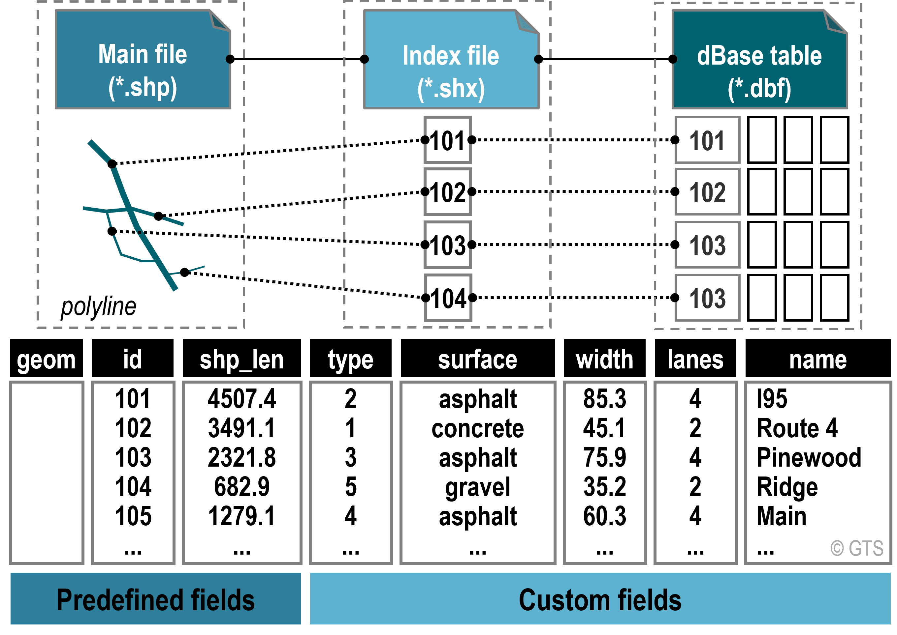
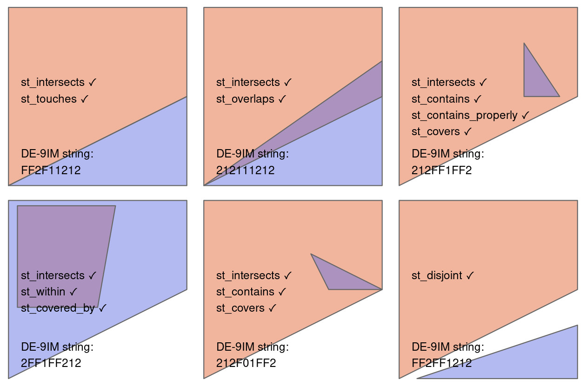

::: {.content-visible unless-format="revealjs"}

<center class='mb-3'>
<a class="h2" href="./slides.html" target="_blank">Open slides in new tab &rarr;</a>
</center>

:::

# Logistical Table-Setting {.title-09}

* HW1 Public Tests will be updated ASAP
* TA Intros!
* Coding Workshops!

::: {.hidden}

```{r}
#| label: r-source-globals
source("../dsan-globals/_globals.r")
source("../dsan-globals/_globals-sf.r")
final_render <- FALSE
```

:::

## TA Intros {.title-11 .crunch-title .smaller .text-65 .crunch-p-top .crunch-img}

[*(In alphabetical order by surname wohoo)*]{.text-80}

:::: {.columns}
::: {.column width="50%"}

<center>

**Jackson Howes** (DSAN)<br>`jh2787@georgetown.edu`

</center>

* BS in Government AND Mathematics (Honors), [St. Lawrence](https://maps.app.goo.gl/RNfyuPWCeSySwx528), Canton, NY
* Survived fire and flames of **this class** 🤯

:::
::: {.column width="50%"}

<center>

**Hermine Wilhelmsen** (McCourt)<br>`hw623@georgetown.edu`

</center>

* Recent MSc in Sustainability and Social Innovation, [HEC Paris](https://maps.app.goo.gl/jVRDTu4DzkERn9vY6) 🥳🧑‍🎓
* Ombuds-person, [UNFCCC alum](https://unfccc.int/)

:::
::::

:::: {.columns}
::: {.column width="50%"}

{fig-align="center" width="200"}

:::
::: {.column width="50%"}

{fig-align="center" width="260"}

:::
::::

::: {.callout-note appearance="minimal"}

Relevant Word of the Day: **山** (*Shān*) = **Mountain**

:::

# Where We Left Off: Let's Make Some Dang Maps! {data-stack-name="WKT Geoms in sf"}

## Our First Map: Polygons! {.smaller .crunch-title}

From [OpenData DC](https://opendata.dc.gov/datasets/DCGIS::census-tracts-in-2020/explore?location=38.892213%2C-77.017144%2C11)... Last week `.shp`, this week `.geojson`!

```{r}
#| label: load-dc-sf
#| echo: true
#| code-fold: show
library(tidyverse)
library(rmarkdown)
library(sf)
# Load DC tracts data
dc_sf_fpath <- "data/Census_Tracts_-_2020.geojson"
dc_sf <- st_read(dc_sf_fpath);
cols_to_keep <- c(
  "OBJECTID", "TRACT", "GEOID", "ALAND", "AWATER",
  "STUSAB", "SUMLEV", "GEOCODE", "STATE", "NAME",
  "POP100", "HU100", "geometry"
)
dc_sf <- dc_sf |> select(cols_to_keep)
```

## `sf` Objects {.smaller .crunch-title .crunch-p}

`dc_sf` is an R [object]{.boxed-g} of type `sf` (short for **"simple features"**), which extends [`data.frame`]{.boxed-g} by adding a **special column** named [`geometry`]{.boxed-g} (containing **`POLYGON`**s)

```{r}
#| label: dc-sf-properties
#| echo: true
class(dc_sf)
dim(dc_sf)
rmarkdown::paged_table(dc_sf, options=list(rows.print=6))
```

## What Are These `POLYGON` Objects? {.smaller}

```{r}
#| label: disp-polygons
#| echo: true
#| code-fold: show
head(dc_sf)
```

## Zoom... Enhance... {.smaller}

:::: {.columns}
::: {.column width="50%"}

<i class='bi bi-1-circle'></i> Let's try printing just the first row?

```{r}
#| label: disp-first-row
#| echo: true
#| code-fold: show
rmarkdown::paged_table(dc_sf[1,])
```

:::
::: {.column width="50%"}

<i class='bi bi-2-circle'></i> Printing the special `geometry` column?

```{r}
#| label: disp-first-poly
#| echo: true
#| code-fold: show
rmarkdown::paged_table(dc_sf[1, "geometry"])
```

:::
::::

:::: {.columns}
::: {.column width="50%"}

<i class='bi bi-3-circle'></i> Nope, we'll have to **open the "black box"** using the [`st_coordinates()` function](https://r-spatial.github.io/sf/reference/st_coordinates.html) from the `sf` library &rarr;

:::
::: {.column width="50%"}

```{r}
#| label: open-poly-box
#| echo: true
#| code-fold: show
sf::st_coordinates(dc_sf[1,"geometry"])
```

:::
::::

## Working With `sf` Objects {.smaller}

```{r}
#| label: dc-sf-select
#| echo: true
#| code-fold: show
# Select column by name
head(dc_sf$NAME)
# Select column by index
head(dc_sf[,4])
```

## And... Actually Displaying the Map! {.smaller .crunch-quarto-figure .title-12}

```{r}
#| label: dc-sf-display
#| echo: true
#| code-fold: show
#| fig-align: center
# We can extract *just* the geometry column with the st_geometry function...
dc_geo <- sf::st_geometry(dc_sf)
# This produces an object of type "sfc"
class(dc_geo)

# Plot the geometry with base R's plot() function
plot(dc_geo)
```

## More "Modern" Plots with `ggplot2`! {.smaller .crunch-title .title-11}

```{r}
#| label: dc-map-ggplot
#| fig-align: center
library(ggplot2)
dc_sf |>
  ggplot2::ggplot() +
  ggplot2::geom_sf() +
  ggplot2::theme_classic()
```

```{r}
dc_sf |>
  ggplot2::ggplot() +
  ggplot2::geom_sf() +
  ggplot2::theme_classic()
```

# How to *Do Things* with Geometries {data-stack-name="Overview"}

{target='_blank'}](images/sf_full.svg){fig-align="center"}

## HW1 $\rightarrow$ HW2 {.crunch-title .crunch-ul .inline-90 .crunch-li-8}

* Once you finish HW1, you'll know how to **create** geometries with `sf` and `terra`
* So now, what can you **do** with them?
* For example, we'd like to be able to say things like:
    * *"The new lamppost cannot be placed at $(x, y)$, since there is already a building there!"*
    * *"There are $N_1$ lampposts in County 1, and $N_2$ lampposts in County 2"*
    * *"The average resident in Neighborhood A lives 2 km away from their nearest bus stop*

## First Things First: Loading and Saving

* Note how there were **no data files** in HW1 😱
* From HW2 onwards (and in your GIS life), we'll:
  * Download from e.g. city Open Data Portals: geo data **files**, but also loading **on-the-fly** (this week)
  * Summarize/aggregate (this week and next week)
  * **Visualize** findings ("Mapping Libraries" unit)

# Vector Formats {data-stack-name="Data Formats"}

## Shapefiles (`.shp` et al.)

A shape*"file"* is actually **(at least) three separate files** bundled together:

* <span class="badge rounded-pill text-bg-secondary"><i class='bi bi-exclamation-circle pe-1'></i> Mandatory</span> `.shp`: Containing feature geometries
* <span class="badge rounded-pill text-bg-secondary"><i class='bi bi-exclamation-circle pe-1'></i> Mandatory</span> `.shx`: Positional indices
* <span class="badge rounded-pill text-bg-secondary"><i class='bi bi-exclamation-circle pe-1'></i> Mandatory</span> `.dbf`: Data attributes
* <span class="badge rounded-pill text-bg-light"><i class='bi bi-question-circle pe-1'></i> Optional</span> `.prj`: Coordinate reference system
* <span class="badge rounded-pill text-bg-light"><i class='bi bi-question-circle pe-1'></i> Optional</span> `.xml`: Metadata

## Shapefiles {.crunch-title .smaller}

Let's see what's inside the shapefile we first saw in Week 1, containing data on DC's **Census Tracts**: [Census Tracts in 2020](https://opendata.dc.gov/datasets/DCGIS::census-tracts-in-2020/explore){target='_blank'} 

{target='_blank'}](images/open_data_dc.jpg){fig-align="center"}

## Shapefile Anatomy

{fig-align="center"}

## GeoJSON / TopoJSON (`.geojson`)

:::: {.columns}
::: {.column width="50%"}

* **J**ava**S**cript **O**bject **N**otation: General cross-platform format
* Useful when data is too complex for e.g. `.csv`
* [TopoJSON](https://github.com/topojson/topojson){target='_blank'} = Memory-efficient GeoJSON
* Bonus: [Inline preview](https://gist.github.com/jpowerj/880fb251add1c7d414bd758c77038c35){target='_blank'} on GitHub!

:::
::: {.column width="50%"}

``` {.json filename="my_data.geojson"}
{
  "type": "FeatureCollection",
  "features": [
    {
      "type": "Feature",
      "geometry": {
        "type": "Polygon",
        "coordinates": [
          [
            [30, 20], [45, 40],
            [10, 40], [30, 20]
          ]
        ]
      },
      "properties": {
        "color": "green",
        "area": 3565747
      }
    },
    {
      "type": "Feature",
      "geometry": {
        "type": "Polygon",
        "coordinates": [
          [
            [15, 5], [40, 10],
            [10, 20], [5, 10], 
            [15, 5]
          ]
        ]
      },
      "properties": {
        "color": "red",
        "area": 3272386
      }
    }
  ]
}
```

:::
::::

## GeoPackage (`.gpkg`)

* Open-source (non-proprietary) [data format standard](https://www.geopackage.org/){target='_blank'}

## Raster Formats

* **GeoTIFF (`.tif` or `.tiff`)**
  * Based on TIFF format developed at NASA
* **NetCDF (`.nc4`)**
  * Used in **earth sciences**, as format for data sources measured and distributed multiple times per day over large full-country or full-continent areas.

## Coordinate Reference Systems (CRS) {.crunch-title .text-80}

* **EPSG** (European Petroleum Survey Group) Registry: Most common way to specify a CRS
  * For example, **4326** is the EPSG code for the WGS84 coordinate system
* **PROJ**: Rather than opaque numeric code like EPSG, uses **plaintext** "proj-strings" containing parameter info: datum, ellipsoid, projection, and units (e.g. meters). Example: `PROJ4` code `EPSG:4326` is represented as

  ```
  +proj=longlat +ellps=WGS84 +datum=WGS84 +no_defs
  ```

* **WKT**: [Lengthy but human-readable descriptions](https://en.wikipedia.org/wiki/Well-known_text_representation_of_coordinate_reference_systems){target='_blank'}

# Geospatial Operations 1: Unary Operations {data-stack-name="Unary Operations"}

## Getting the Geometries {.smaller .crunch-title .fix-mapview}

Using [`rnaturalearth`](http://ropensci.github.io/rnaturalearth/){target='_blank'} with [`mapview`](https://r-spatial.github.io/mapview/){target='_blank'}

```{r}
#| label: france-mapview
set.seed(6805)
library(tidyverse)
library(sf)
library(rnaturalearth)
library(mapview)
france_sf <- ne_countries(country = "France", scale = 50)
(france_map <- mapview(france_sf, label = "geounit", legend = FALSE))
```

## Centroid of France

```{r}
#| label: france-centroid
france_cent_sf <- sf::st_centroid(france_sf)
france_map + mapview(france_cent_sf, label = "Centroid", legend = FALSE)
```

## One We Already Saw: Union {.smaller .crunch-title .leaflet-375}

Computing the **union** of all geometries in the `sf` via `sf::st_union()`

```{r}
#| label: africa-union
library(leaflet.extras2)
africa_sf <- ne_countries(continent = "Africa", scale = 50)
africa_union_sf <- sf::st_union(africa_sf)
africa_map <- mapview(africa_sf, label="geounit", legend=FALSE)
africa_union_map <- mapview(africa_union_sf, label="st_union(africa)", legend=FALSE)
africa_map | africa_union_map
```

## Helpful for Rasterizing: BBox

```{r}
#| label: africa-bbox
africa_bbox_sf <- sf::st_bbox(africa_sf)
africa_bbox_map <- mapview(africa_bbox_sf, label="st_bbox(africa)", legend=FALSE)
africa_map | africa_bbox_map
```

## Convex Hulls by Country

```{r}
#| label: africa-countries-convex-hull
africa_countries_cvx <- sf::st_convex_hull(africa_sf)
africa_countries_cvx_map <- mapview(africa_countries_cvx, label="geounit", legend=FALSE)
africa_map | africa_countries_cvx_map
```

## Convex Hull of Continent {.smaller .crunch-title .leaflet-375}

Use `st_union()` first:

```{r}
#| label: africa-convex_hull
africa_cvx <- africa_sf |> st_union() |> st_convex_hull()
africa_cvx_map <- mapview(africa_cvx, label="geounit", legend=FALSE)
africa_map | africa_cvx_map
```

## One We Already Saw: Centroids {.smaller .crunch-title .leaflet-375}

Computing the **centroid** of all geometries in the `sf` via `sf::st_centroid()`

```{r}
#| label: africa-centroids
africa_cents_sf <- sf::st_centroid(africa_sf)
africa_cents_map <- mapview(africa_cents_sf, label="geounit", legend=FALSE)
africa_map | africa_cents_map
```

# Geospatial Operations 2: Binary Operations {data-stack-name="Binary Operations"}

## Spatial Joins {.smaller .crunch-title .crunch-img}

```{r}
#| label: spatial-join
#| output-location: column
#| fig-height: 6
nc <- system.file("shape/nc.shp", package="sf") |>
  read_sf() |>
  st_transform('EPSG:2264')
gr <- st_sf(
         label = apply(expand.grid(1:10, LETTERS[10:1])[,2:1], 1, paste0, collapse = ""),
         geom = st_make_grid(nc))
gr$col <- sf.colors(10, categorical = TRUE, alpha = .3)
# cut, to verify that NA's work out:
gr <- gr[-(1:30),]
suppressWarnings(nc_j <- st_join(nc, gr, largest = TRUE))
par(mfrow = c(2,1), mar = rep(0,4))
plot(st_geometry(nc_j), border = 'grey')
plot(st_geometry(gr), add = TRUE, col = gr$col)
text(st_coordinates(st_centroid(st_geometry(gr))), labels = gr$label, cex = .85)
# the joined dataset:
plot(st_geometry(nc_j), border = 'grey', col = nc_j$col)
text(st_coordinates(st_centroid(st_geometry(nc_j))), labels = nc_j$label, cex = .7)
plot(st_geometry(gr), border = '#88ff88aa', add = TRUE)
```

## Spatial Sampling {.smaller .leaflet-375}

```{r}
#| label: spatial-sampling
# Sample random points
africa_points_list <- sf::st_sample(africa_union_sf, 10)
africa_points_sf <- sf::st_sf(africa_points_list)
africa_points_map <- mapview(africa_points_sf, label="Random Point", col.regions=cb_palette[1], legend=FALSE)
africa_map + africa_points_map
```

## The "Default" Predicate: `st_intersects` {.smaller .title-10}

```{r}
#| label: st-intersects-default
countries_w_points <- africa_sf[africa_points_sf,]
mapview(countries_w_points, label="geounit", legend=FALSE) + africa_points_map
```

## Counting with `lengths()` {.smaller .crunch-title}

```{r}
#| label: count-points
country_inter <- sf::st_intersects(africa_sf, africa_points_sf)
# Computes point counts for each polygon
(num_intersections <- lengths(country_inter))
africa_sf <- africa_sf |> mutate(
  num_points = num_intersections
) |> arrange(geounit)
africa_sf |> select(geounit, num_points) |> head()
```

## Plotting with `mapview`

```{r}
#| label: points-choro-mapview
mapview(africa_sf, zcol="num_points")
```

## Plotting with `ggplot2` {.smaller .crunch-title}

Since we're starting to get into **data** attributes rather than **geometric** features, switching to `ggplot2` is recommended!

```{r}
#| label: points-choro-ggplot
africa_sf |> ggplot(aes(fill=num_points)) +
  geom_sf() +
  theme_classic()
```

## Getting Fancier...

* To do fancier geospatial operations, we'll need to start **overthinking** the different possible **relationships** between two or more geometries!
* To this end: **predicates**

{fig-align="center"}

## References

::: {#refs}
:::
