::: {.content-visible unless-format="revealjs"}
<center class="mb-3">

<a class="h2" href="./slides.html" target="_blank">Open slides in new tab →</a>

</center>
:::

# Geospatial Operations 2: Binary Operations {data-stack-name="Binary Operations"}

::: hidden
```{r}
#| label: r-source-globals
source("../dsan-globals/_globals.r")
source("../dsan-globals/_globals-sf.r")
library(tidyverse) |> suppressPackageStartupMessages()
library(sf) |> suppressPackageStartupMessages()
library(rnaturalearth) |> suppressPackageStartupMessages()
library(mapview) |> suppressPackageStartupMessages()
library(leaflet.extras2) |> suppressPackageStartupMessages()
```
:::

## Spatial Sampling {.smaller .leaflet-375 .crunch-title}

```{r}
#| label: spatial-sampling
africa_countries_sf <- ne_countries(continent = "Africa", scale = 50)
africa_union_sf <- sf::st_union(africa_countries_sf)
africa_map <- mapview(africa_countries_sf, label="geounit", legend=FALSE)
# Sample random points
set.seed(6805)
africa_points_list <- sf::st_sample(africa_union_sf, 10)
africa_points_sf <- sf::st_sf(africa_points_list)
africa_points_map <- mapview(africa_points_sf, label="Random Point", col.regions=cb_palette[1], legend=FALSE)
africa_map + africa_points_map
```

## The "Default" Predicate: `st_intersects` {.smaller .title-10}

```{r}
#| label: st-intersects-default
countries_with_points <- africa_countries_sf[africa_points_sf,]
mapview(countries_with_points, label="geounit", legend=FALSE) + africa_points_map
```

## Counting with `lengths()` {.smaller .crunch-title}

```{r}
#| label: count-points
country_inter <- sf::st_intersects(africa_countries_sf, africa_points_sf)
# Computes point counts for each polygon
(num_intersections <- lengths(country_inter))
africa_countries_sf <- africa_countries_sf |> mutate(
  num_points = num_intersections
) |> arrange(geounit)
africa_countries_sf |> select(geounit, num_points) |> head(4)
```

## Plotting with `mapview` {.smaller .crunch-title .crunch-p}

`zcol`: Since our screens are 2D, how should we represent the third dimension?

```{r}
#| label: points-choro-mapview
mapview(africa_countries_sf, label="geounit", zcol="num_points")
```

## Plotting with `ggplot2` {.smaller .crunch-title}

Since we're incorporating **data attributes** (all columns besides `geometry`) on top of **geometric features** (the `geometry` column), switching to `ggplot2` is recommended! (Think of `mapview()` as a viewer for *just* `geometry`, plus maybe one data attribute)

```{r}
#| label: points-choro-ggplot
africa_countries_sf |> ggplot(aes(fill=num_points)) +
  geom_sf() +
  theme_classic() + theme(plot.title=element_text(hjust=0.5)) +
  labs(title="Number of Points Per Country")
```

## One More Unary Operation: `st_buffer()` {.title-08}

-   Think about how you might answer questions like:
    -   "How far is your house (`POINT`) from Manhattan (`POLYGON`)?"
    -   "Are there any chemical plants within a mile of this building (`POLYGON`) / stretch of road (`LINESTRING`)?"
-   Lazy mode: Compute distances from the **centroid**
-   GIS master mode: Construct the **buffer**!

## `st_buffer(POLYGON)` $\mapsto$ Bigger `POLYGON` {.smaller .crunch-title .title-10 .crunch-p .leaflet-400 .text-60}

<i class='bi bi-1-circle'></i> Census Tracts: `tidycensus::get_acs(state = "NY", county = "New York")`

<i class='bi bi-2-circle'></i> County-Wide `POLYGON`: `manhattan_union_sf <- st_union(manhattan_sf)`

<i class='bi bi-3-circle'></i> `buffer_sf <- manhattan_union_sf |> st_buffer(dist = 1609.34)` (mile $\approx$ 1609.34 meters)

```{r}
#| label: manhattan-buffer
#| warning: false
#| code-fold: true
library(tidyverse)
library(sf)
library(tidycensus)
library(tigris)
library(mapview)
options(tigris_use_cache = TRUE)
manhattan_sf <- tidycensus::get_acs(
  geography = "tract",
  variables = "B19013_001",
  state = "NY",
  county = "New York",
  year = 2020,
  geometry = TRUE,
  cb = FALSE,
  key = Sys.getenv('CENSUS_API_KEY')
)
# Erase the island tracts real quick
island_tracts <- c(
  "Census Tract 1, New York County, New York",
  "Census Tract 2.02, New York County, New York"
)
manhattan_sf <- manhattan_sf |> filter(
  !(NAME %in% island_tracts)
)
# Union of all census tracts within the county
manhattan_union_sf <- st_union(manhattan_sf)
manhattan_union_map <- mapview(manhattan_union_sf, label="New York County")
# Construct buffer (1 mile ~= 1609.34 meters)
manhattan_buffer_sf <- manhattan_union_sf |> st_buffer(dist = 1609.34)
manhattan_buffer_map <- mapview(manhattan_buffer_sf, label="Buffer (1 Mile)", col.regions = cb_palette[1], legend = TRUE)
manhattan_buffer_map + manhattan_union_map
```

## Just the "Ring"? Another Binary Operation! `st_difference()` {.smaller .crunch-title .title-08}

```{r}
#| label: buffer-only
buffer_only_sf <- sf::st_difference(manhattan_buffer_sf, manhattan_union_sf)
mapview(buffer_only_sf, col.regions=cb_palette[1])
```

*(You may know this as the **disjoint union**... But `st_disjoint()` is a **predicate!**)*

## `st_buffer(LINESTRING)` $\mapsto$ `POLYGON` {.smaller .crunch-title .title-12}

```{r}
#| label: st-buffer-linestring
#| code-fold: true
#| fig-cap: "From the [`sf` Documentation](https://r-spatial.github.io/sf/reference/geos_unary.html){target='_blank'}"
library(tidyverse)
library(sf)
## st_buffer, style options (taken from rgeos gBuffer)
l1 = st_as_sfc("LINESTRING(0 0,1 5,4 5,5 2,8 2,9 4,4 6.5)")
op = par(mfrow=c(2,3))
plot(st_buffer(l1, dist = 1, endCapStyle="ROUND"), reset = FALSE, main = "endCapStyle: ROUND")
plot(l1,col='blue',add=TRUE)
plot(st_buffer(l1, dist = 1, endCapStyle="FLAT"), reset = FALSE, main = "endCapStyle: FLAT")
plot(l1,col='blue',add=TRUE)
plot(st_buffer(l1, dist = 1, endCapStyle="SQUARE"), reset = FALSE, main = "endCapStyle: SQUARE")
plot(l1,col='blue',add=TRUE)
plot(st_buffer(l1, dist = 1, nQuadSegs=1), reset = FALSE, main = "nQuadSegs: 1")
plot(l1,col='blue',add=TRUE)
plot(st_buffer(l1, dist = 1, nQuadSegs=2), reset = FALSE, main = "nQuadSegs: 2")
plot(l1,col='blue',add=TRUE)
plot(st_buffer(l1, dist = 1, nQuadSegs= 5), reset = FALSE, main = "nQuadSegs: 5")
plot(l1,col='blue',add=TRUE)
```

## What Makes Binary Operations "Fancier"? {.smaller .title-12 .crunch-title .crunch-ul .crunch-li-8 .crunch-p .crunch-ul-left .text-65}

:::: {.columns}
::: {.column width="50%"}

<center>**Unary**</center>

-   `st_centroid()`
    -   `POLYGON` $\mapsto$ `POINT`
    -   `MULTIPOLYGON` $\mapsto$ `POINT`
-   `st_convex_hull()`
    -   `POLYGON` $\mapsto$ `POLYGON`
    -   `MULTIPOINT` $\mapsto$ `POLYGON`

:::
::: {.column width="50%"}

<center>**Binary**</center>

-   `st_intersection()`
    -   (`POINT`, `POINT`) $\mapsto$ `POINT | POINT EMPTY`
    -   (`POLYGON`, `POLYGON`) $\mapsto$ `POLYGON | LINESTRING | POINT | POLYGON EMPTY`

:::
::::

*(Test yourself by asking: what would `st_x(g)` produce, for different types `g`!)*

-   `st_is_empty()` and `st_dimension()` become your [new best friends](https://r-spatial.github.io/sf/reference/geos_query.html){target="_blank"} 😉
-   `st_is_empty()`: Distinguishes between, e.g., `POINT EMPTY` and `POINT(0 0)`
-   `st_dimension()`: `NA` for `EMPTY`, otherwise
    -   `2` for surfaces (`POLYGON`, `MULTIPOLYGON`)
    -   `1` for lines (`LINESTRING`, `MULTILINESTRING`)
    -   `0` for points (`POINT`, `MULTIPOINT`)

## Bad Overthinking: Will My Life Just Get Harder and Harder? {.smaller .crunch-title .title-10 .crunch-img .crunch-quarto-layout-panel .crunch-quarto-figure .crunch-figure}

:::: {layout="[1,1]" layout-valign="center" layout-align="center"}
{fig-align="center" width="170"}

::: {#bored-pooh}
Unary Operations
:::
::::

:::: {layout="[1,1]" layout-valign="center" layout-align="center"}
{fig-align="center" width="170"}

::: {#fancy-pooh}
Binary Operations
:::
::::

:::: {layout="[1,1]" layout-valign="center" layout-align="center"}
{fig-align="center" width="170"}

::: {#fanciest-pooh}
Ternary Operations
:::
::::

:::: {layout="[1,1]" layout-valign="center" layout-align="center"}
{fig-align="center" width="170"}

<div>

Quaternary Operations

</div>
::::

## Good News and Bad News {.smaller .crunch-title .crunch-ul .crunch-li-8}

-   The good news: No!
-   The bad news: You'll have to read the 465-page [Volume I](https://www.google.com/books/edition/Basic_Algebra/bOElBQAAQBAJ?hl=en&gbpv=0){target="_blank"} and then the 451-page [Volume II](https://www.google.com/books/edition/Further_Algebra_and_Applications/2Z_OC6uGzkwC?hl=en&sa=X&ved=2ahUKEwjCmMONmsyIAxWxKFkFHU7PGtAQiqUDegQIFBAH){target="_blank"} and then to page 15 of [Volume III](https://www.google.com/books/edition/Universal_Algebra/6tbuCAAAQBAJ?hl=en&gbpv=0){target="_blank"} of @cohn_universal_1965 to know why:

:::::: columns
::: {.column width="50%"}
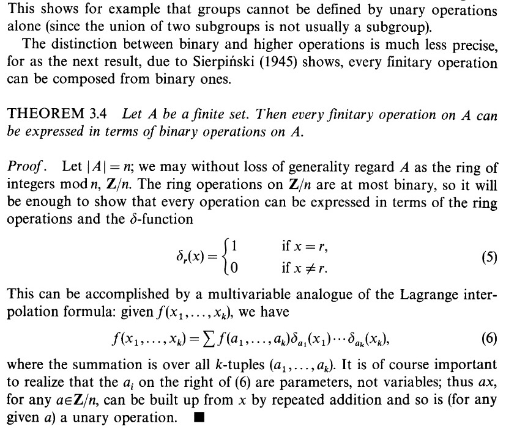{fig-align="center"}
:::

:::: {.column width="50%"}
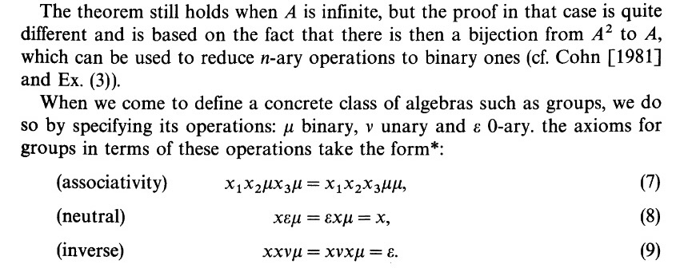{fig-align="center"}

::: {#rantyrant style="font-size: 10pt;"}
*(i spent 4 yrs of undergrad studying abstract algebra and now it all sits gathering dust somewhere deep within my brain plz just let me have this moment i'll never mention it again i promise)*
:::
::::
::::::

## Good Overthinking: A *Language* for Binary Predicates! {.smaller .crunch-title .crunch-ul .title-09}

* For fancier geospatial operations, need a language that can "capture" **all possible geometric relationships** 
  * (Like how [WKT](https://en.wikipedia.org/wiki/Well-known_text_representation_of_geometry) can handle all possible 2D geometric *objects*)
  * (Or how [WGS84](https://epsg.io/4326) can handle all possible points on Earth's surface)
* $\leadsto$ Relational **Predicates** combined with **and**, **or**, **not**

 in @lovelace_geocomputation_2024](images/relations.png){fig-align="center"}

# Ambiguous $\rightarrow$ Precise: Enter DE-9IM! {data-stack-name="DE-9IM"}

## DE-9IM Strings {.smaller .crunch-title .crunch-p .crunch-li-8 .crunch-ul}

Each cell here visualizes one component of the DE-9IM string `1020F1102`, which describes the relationship between the following two geometries:

-   **Boxey McBoxface**: `POLYGON(0 0, 1 0, 1 1, 0 1, 0 0)`
-   **Liney McLineface**: `LINESTRING(0.5 -0.5, 0.5 0.5)`

```{r}
#| label: de-9im-strings
#| echo: true
#| code-fold: true
#| fig-align: center
#| fig-cap: "Code from @pebesma_spatial_2023"
library(sf)
polygon <- po <- st_polygon(list(rbind(c(0,0), c(1,0), c(1,1), c(0,1), c(0,0))))
p0 <- st_polygon(list(rbind(c(-1,-1), c(2,-1), c(2,2), c(-1,2), c(-1,-1))))
line <- li <- st_linestring(rbind(c(.5, -.5), c(.5, 0.5)))
s <- st_sfc(po, li)

par(mfrow = c(3,3))
par(mar = c(1,1,1,1))

# "1020F1102"
# 1: 1
plot(s, col = c(NA, 'darkgreen'), border = 'blue', main = expression(paste("I(pol)",intersect(),"I(line) = 1")))
lines(rbind(c(.5,0), c(.5,.495)), col = 'red', lwd = 2)
points(0.5, 0.5, pch = 1)

# 2: 0
plot(s, col = c(NA, 'darkgreen'), border = 'blue', main = expression(paste("I(pol)",intersect(),"B(line) = 0")))
points(0.5, 0.5, col = 'red', pch = 16)

# 3: 2
plot(s, col = c(NA, 'darkgreen'), border = 'blue', main = expression(paste("I(pol)",intersect(),"E(line) = 2")))
plot(po, col = '#ff8888', add = TRUE)
plot(s, col = c(NA, 'darkgreen'), border = 'blue', add = TRUE)

# 4: 0
plot(s, col = c(NA, 'darkgreen'), border = 'blue', main = expression(paste("B(pol)",intersect(),"I(line) = 0")))
points(.5, 0, col = 'red', pch = 16)

# 5: F
plot(s, col = c(NA, 'darkgreen'), border = 'blue', main = expression(paste("B(pol)",intersect(),"B(line) = F")))

# 6: 1
plot(s, col = c(NA, 'darkgreen'), border = 'blue', main = expression(paste("B(pol)",intersect(),"E(line) = 1")))
plot(po, border = 'red', col = NA, add = TRUE, lwd = 2)

# 7: 1
plot(s, col = c(NA, 'darkgreen'), border = 'blue', main = expression(paste("E(pol)",intersect(),"I(line) = 1")))
lines(rbind(c(.5, -.5), c(.5, 0)), col = 'red', lwd = 2)

# 8: 0
plot(s, col = c(NA, 'darkgreen'), border = 'blue', main = expression(paste("E(pol)",intersect(),"B(line) = 0")))
points(.5, -.5, col = 'red', pch = 16)

# 9: 2
plot(s, col = c(NA, 'darkgreen'), border = 'blue', main = expression(paste("E(pol)",intersect(),"E(line) = 2")))
plot(p0 / po, col = '#ff8888', add = TRUE)
plot(s, col = c(NA, 'darkgreen'), border = 'blue', add = TRUE)
```

-   The predicate `equals` corresponds to the DE-9IM string `"T*F**FFF*"`. If any two geometries obey this relationship, they are (topologically) equal!

## Slowing Down: 9IM *(no DE yet!)* {.smaller .crunch-title .crunch-img .table-va}

::: {#tbl-polys}
| 9IM | Interior | Boundary | Exterior |
|:----------------:|:----------------:|:----------------:|:----------------:|
| **Interior** | 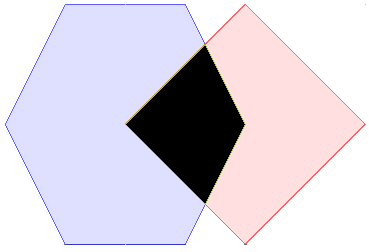{.de9im fig-align="center"}<br>  | 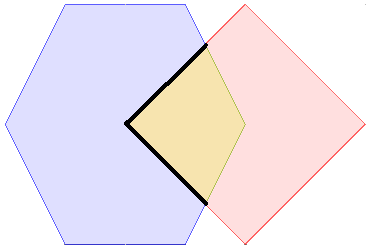{.de9im fig-align="center"}<br>  | 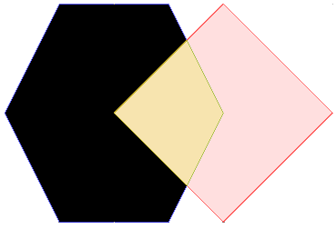{.de9im fig-align="center"}<br>  |
| **Boundary** | 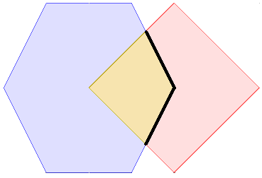{.de9im fig-align="center"}<br>  | 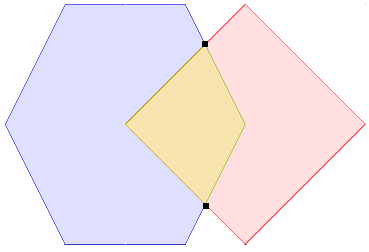{.de9im fig-align="center"}<br>  | 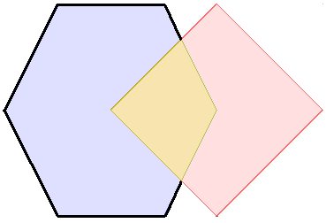{.de9im fig-align="center"}<br>  |
| **Exterior** | 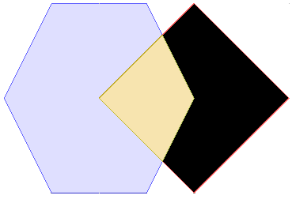{.de9im fig-align="center"}<br>  | 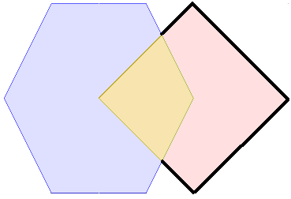{.de9im fig-align="center"}<br>  | 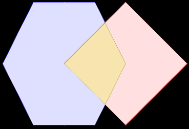{.de9im fig-align="center"}<br>  |

From [OSGeo Project](https://docs.geotools.org/latest/userguide/library/jts/dim9.html){target="_blank"}
:::

## *Dimensionally Extended* (DE) 9IM {.smaller .crunch-title .crunch-img .table-va}

::: {#tbl-de-polys}
| 9IM | Interior | Boundary | Exterior |
|:----------------:|:----------------:|:----------------:|:----------------:|
| **Interior** | {.de9im fig-align="center"}<br>2 | {.de9im fig-align="center"}<br>1 | {.de9im fig-align="center"}<br>2 |
| **Boundary** | {.de9im fig-align="center"}<br>1 | {.de9im fig-align="center"}<br>0 | {.de9im fig-align="center"}<br>1 |
| **Exterior** | {.de9im fig-align="center"}<br>2 | {.de9im fig-align="center"}<br>1 | {.de9im fig-align="center"}<br>2 |

From [OSGeo Project](https://docs.geotools.org/latest/userguide/library/jts/dim9.html){target="_blank"}
:::

## Crunching it Down into a Tiny Box {.crunch-title}

| DE-9IM       | Interior | Boundary | Exterior |
|:-------------|:--------:|:--------:|:--------:|
| **Interior** |    2     |    1     |    2     |
| **Boundary** |    1     |    0     |    1     |
| **Exterior** |    2     |    1     |    2     |

**...And Then into a Tiny String**

<center style="margin-bottom: 10px;">

[`212101212`]{.boxed-cb}

</center>

...And Then into an Infinitesimally-Small Point

{.nostretch .lightbox fig-align="center" width="15px"}

## DE-9IM *Masks* {.smaller .crunch-title .crunch-ul}

-   Now terms can be given **unambiguous, precise meaning!**

| [`st_overlaps()`](https://r-spatial.github.io/sf/reference/geos_binary_pred.html){target="_blank"} | Interior | Boundary | Exterior |
|:-----------------|:----------------:|:----------------:|:----------------:|
| **Interior** | `T` | `*` | `T` |
| **Boundary** | `*` | `*` | `*` |
| **Exterior** | `T` | `*` | `*` |

-   Special Values (besides `0`, `1`, `2`):
    -   `T`: "True" (non-empty, `st_dimension() >= 0`)
    -   `F`: "False" (empty, `st_dimension() == NA`)
    -   `*`: "Wildcard" (Don't care what the value is)
-   `st_overlaps()`: `T*T***T**`, `st_equals()`: `T*F**FFF*`

## DE-9IM vs. Everyday Language {.smaller .crunch-title .crunch-ul-left}

-   DE-9IM can (in theory) represent $6^9 = 10~077~696$ possible geometric relationships!
-   The English language has like 10, and they're ambiguous ☠️ *(Compromise employed by GIS systems: allow [multiple masks](https://postgis.net/docs/ST_Intersects.html) for **same** English word)*:

| English    | Mask        | `212101212` | Result                    |
|------------|-------------|-------------|---------------------------|
| "Disjoint" | `FF*FF****` | `FALSE`     | `x` not disjoint from `y` |
| "Touches"  | `FT*******` | `FALSE`     | `x` doesn't touch `y`     |
| "Touches"  | `F***T****` | `FALSE`     | `x` doesn't touch `y`     |
| "Crosses"  | `T*T***T**` | `TRUE`      | `x` crosses `y`           |
| "Within"   | `TF*F*****` | `FALSE`     | `x` is not within `y`     |
| "Overlaps" | `T*T***T**` | `TRUE`      | `x` overlaps `y`          |

## `st_relate()`: The Ultimate Predicate {.smaller .crunch-title .title-12}

```{r}
#| label: st-relate
library(tidyverse)
library(rnaturalearth)
us <- ne_states(country="United States of America")
dc <- us |> filter(iso_3166_2 == "US-DC")
us <- us |>
  mutate(
    de9im = st_relate(us, dc),
    touch = st_touches(us, dc, sparse = F)
  ) |>
  select(iso_3166_2, name, de9im, touch) |>
  arrange(name)
us
```

## (If You Don't Want to Scroll) {.smaller}

```{r}
#| label: st-relate-filtered
us |> filter(touch)
```

## References

::: {#refs}
:::
