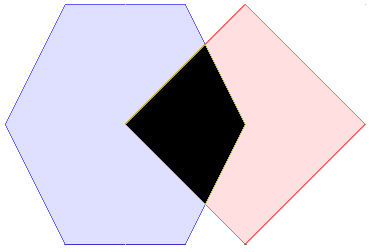
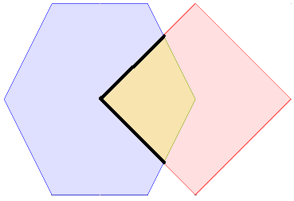
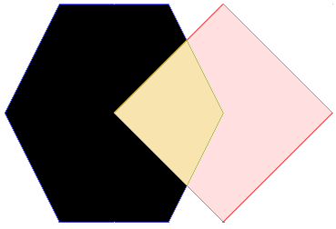
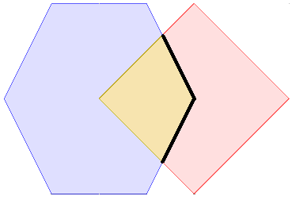
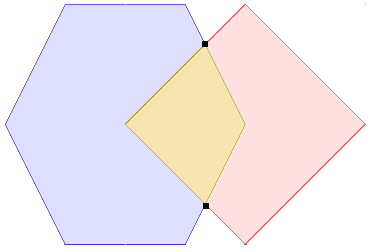
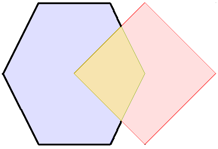
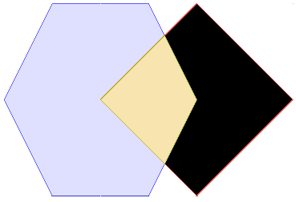
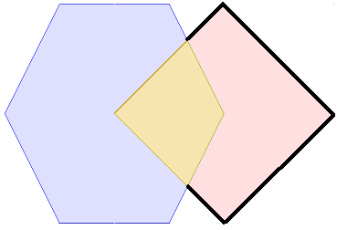
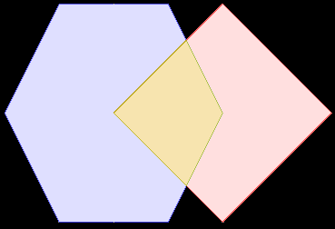

::: {.content-visible unless-format="revealjs"}

<center class='mb-3'>
<a class="h2" href="./slides.html" target="_blank">Open slides in new tab &rarr;</a>
</center>

:::

# Doing Things with DE-9IM (Back to Binary Operations) {data-stack-name="DE-9IM"}

::: {.hidden}

```{r}
#| label: slides-init
source("../dsan-globals/_globals.r")
source("../dsan-globals/_globals-sf.r")
library(tidyverse) |> suppressPackageStartupMessages()
library(sf) |> suppressPackageStartupMessages()
library(rnaturalearth) |> suppressPackageStartupMessages()
library(mapview) |> suppressPackageStartupMessages()
```

:::

## Slowing Down: 9IM *(no DE yet!)* {.smaller .crunch-title .crunch-img .table-va}

::: {#tbl-polys}
| 9IM | Interior | Boundary | Exterior |
|:----------------:|:----------------:|:----------------:|:----------------:|
| **Interior** | {.de9im fig-align="center"}<br>  | {.de9im fig-align="center"}<br>  | {.de9im fig-align="center"}<br>  |
| **Boundary** | {.de9im fig-align="center"}<br>  | {.de9im fig-align="center"}<br>  | {.de9im fig-align="center"}<br>  |
| **Exterior** | {.de9im fig-align="center"}<br>  | {.de9im fig-align="center"}<br>  | {.de9im fig-align="center"}<br>  |

From [OSGeo Project](https://docs.geotools.org/latest/userguide/library/jts/dim9.html){target="_blank"}
:::

## *Dimensionally Extended* (DE) 9IM {.smaller .crunch-title .crunch-img .table-va}

::: {#tbl-de-polys}
| 9IM | Interior | Boundary | Exterior |
|:----------------:|:----------------:|:----------------:|:----------------:|
| **Interior** | {.de9im fig-align="center"}<br>2 | {.de9im fig-align="center"}<br>1 | {.de9im fig-align="center"}<br>2 |
| **Boundary** | {.de9im fig-align="center"}<br>1 | {.de9im fig-align="center"}<br>0 | {.de9im fig-align="center"}<br>1 |
| **Exterior** | {.de9im fig-align="center"}<br>2 | {.de9im fig-align="center"}<br>1 | {.de9im fig-align="center"}<br>2 |

From [OSGeo Project](https://docs.geotools.org/latest/userguide/library/jts/dim9.html){target="_blank"}
:::

## Crunching it Down into a Tiny Box {.crunch-title}

| DE-9IM       | Interior | Boundary | Exterior |
|:-------------|:--------:|:--------:|:--------:|
| **Interior** |    2     |    1     |    2     |
| **Boundary** |    1     |    0     |    1     |
| **Exterior** |    2     |    1     |    2     |

**...And Then into a Tiny String**

<center style="margin-bottom: 10px;">

[`212101212`]{.boxed-cb}

</center>

...And Then into an Infinitesimally-Small Point

{.nostretch .lightbox fig-align="center" width="15px"}

## DE-9IM *Masks* {.smaller .crunch-title .crunch-ul}

-   Now terms can be given **unambiguous, precise meaning!**

| [`st_overlaps()`](https://r-spatial.github.io/sf/reference/geos_binary_pred.html){target="_blank"} | Interior | Boundary | Exterior |
|:-----------------|:----------------:|:----------------:|:----------------:|
| **Interior** | `T` | `*` | `T` |
| **Boundary** | `*` | `*` | `*` |
| **Exterior** | `T` | `*` | `*` |

-   Special Values (besides `0`, `1`, `2`):
    -   `T`: "True" (non-empty, `st_dimension() >= 0`)
    -   `F`: "False" (empty, `st_dimension() == NA`)
    -   `*`: "Wildcard" (Don't care what the value is)
-   `st_overlaps()`: `T*T***T**`, `st_equals()`: `T*F**FFF*`

## DE-9IM vs. Everyday Language {.smaller .crunch-title .crunch-ul-left}

-   DE-9IM can (in theory) represent $6^9 = 10~077~696$ possible geometric relationships!
-   The English language has like 10, and they're ambiguous ☠️ *(Compromise employed by GIS systems: allow [multiple masks](https://postgis.net/docs/ST_Intersects.html) for **same** English word)*:

| English    | Mask        | `212101212` | Result                    |
|------------|-------------|-------------|---------------------------|
| "Disjoint" | `FF*FF****` | `FALSE`     | `x` not disjoint from `y` |
| "Touches"  | `FT*******` | `FALSE`     | `x` doesn't touch `y`     |
| "Touches"  | `F***T****` | `FALSE`     | `x` doesn't touch `y`     |
| "Crosses"  | `T*T***T**` | `TRUE`      | `x` crosses `y`           |
| "Within"   | `TF*F*****` | `FALSE`     | `x` is not within `y`     |
| "Overlaps" | `T*T***T**` | `TRUE`      | `x` overlaps `y`          |

## `st_relate()`: The Ultimate Predicate {.smaller .crunch-title .title-11}

```{r}
#| label: st-relate
#| cols.min.print: 5
#| cols.print: 5
us_sf <- ne_states(iso_a2 = "US") |> add_colonies()
dc_sf <- us_sf |> filter(iso_3166_2 == "US-DC")
us_sf <- us_sf |> mutate(
    de9im = st_relate(us_sf, dc_sf),
    touches_dc = st_touches(us_sf, dc_sf, sparse = F)
  ) |>
  select(iso_3166_2, name, de9im, touches_dc) |>
  arrange(name)
us_sf
```

## (If You Don't Want to Scroll) {.smaller}

```{r}
#| label: st-relate-filtered
us_sf |> filter(touches_dc)
```

# Spatial Joins {data-stack-name="Spatial Joins"}

## Spatial Filter: *Almost* a Spatial Join {.smaller .crunch-title .title-11 .leaflet-350}

```{r}
#| label: almost-spatial-join
set.seed(6805)
N <- 10
africa_sf <- ne_countries(continent = "Africa", scale = 50) |> select(geounit, gdp_md)
africa_union_sf <- sf::st_union(africa_sf)
africa_map <- mapview(africa_sf, label="geounit", legend=FALSE, col.regions=cb_palette[2], alpha.regions=0.5)
sampled_points_sf <- sf::st_sample(africa_union_sf, N) |> sf::st_sf() |> mutate(temp_c = runif(N, 0, 100), pop=rdunif(N, 1, 1000))
sampled_points_map <- mapview(sampled_points_sf, label="Random Point", col.regions=cb_palette[1], legend=FALSE)
countries_points_sf <- africa_sf[sampled_points_sf,]
filtered_map <- mapview(countries_points_sf, label="geounit", legend=FALSE, col.regions=cb_palette[2], alpha.regions=0.5)
(africa_map + sampled_points_map) | (filtered_map + sampled_points_map)
```

## Spatial Filter $\neq$ Spatial Join {.smaller .smaller-table .crunch-title .title-11 .crunch-ul .crunch-p}

* Initial problem: **Attributes of `POINT`s are *not merged into* attributes of `POLYGON`s**
* Deeper problem: **How to merge *multiple* `POINT` attributes into *single* row?**

:::: {.columns}
::: {.column width="48%"}

<center>**`POLYGON` Attributes**</center>

:::
::: {.column width="4%"}

$\overset{?}{\leftarrow}$

:::
::: {.column width="48%"}

<center>**`POINT` Attributes**</center>

:::
::::

:::: {.columns}
::: {.column width="50%"}

```{r}
#| label: poly-attributes-filter
#| rownames.print: false
countries_points_sf |> relocate(geometry, geounit)
```

:::
::: {.column width="50%"}

```{r}
#| label: point-attributes-filter
#| rownames.print: false
st_geometry(sampled_points_sf) <- c("geometry")
sampled_points_sf
```

:::
::::

## Our First Real Spatial Join: `st_join()` {.smaller .crunch-title .title-11}

```{r}
#| label: st-join-first
#| rownames.print: false
joined_sf <- countries_points_sf |> st_join(sampled_points_sf)
joined_sf |> relocate(geounit, temp_c, pop) |> head()
```

{fig-align="center"}

## But... We Were Still in Easy Mode {.crunch-title .crunch-p .text-95}

Every point could be matched to **one** country. But what if... 😱

```{r}
#| label: area-weighted-interpolation-first
#| code-fold: true
g <- st_make_grid(st_bbox(st_as_sfc("LINESTRING(0 0,1 1)")), n = c(2,2))
par(mar = rep(0,4))
plot(g)
plot(g[1] * diag(c(3/4, 1)) + c(0.25, 0.125), add = TRUE, lty = 2)
text(c(.2, .8, .2, .8), c(.2, .2, .8, .8), c(1,2,4,8), col = 'red')
```

# Areal Weighted Interpolation {data-stack-name="Areal Weighted Interpolation"}

## ZIP Codes vs. Census Tracts {.crunch-title .text-75}

```{=html}
<table>
<colgroup>
<col style="width: 5%;">
<col style="width: 34%;">
<col style="width: 33%;">
<col style="width: 28%;">
</colgroup>
<thead>
<tr>
  <th></th>
  <th class='tdl tdvc'>Geographic Unit</th>
  <th class='tdc tdvc'>Administered By</th>
  <th class='tdc tdvc'>For</th>
</tr>
</thead>
<tbody>
<tr>
  <td class='tdvc tdc' rowspan='2'><span data-qmd="<i class='bi bi-people-fill'></i>"></span></td>
  <td class='tdl tdvc tdnb'><span data-qmd="**Census Tracts**"></span></td>
  <td class='tdc tdvc tdnb'>US Census Bureau</td>
  <td class='tdc tdvc tdnb'>Demographic statistics</td>
</tr>
<tr>
  <td colspan='3' class='tdl tdvc'><span data-qmd="<i class='bi bi-arrow-return-right'></i> We are in GeoID $\overbrace{\underbrace{\large\texttt{11}}_{\small\text{State}}\underbrace{\large\texttt{001}}_{\small\text{County}}}^{\small\text{FIPS Code}}\overbrace{\underbrace{\large\texttt{0002}}_{\small\text{Number}}\underbrace{\large\texttt{01}}_{\small\text{Suffix}}}^{\small\text{Census Tract}}$: DC [Census Tract 2.02](https://tigerweb.geo.census.gov/tigerweb/)"></span></td>
</tr>
<tr>
  <td class='tdvc tdc' rowspan='2'><span data-qmd="<i class='bi bi-mailbox-flag'></i>"></span></td>
  <td class='tdl tdvc tdnb'><span data-qmd="**ZIP Code**&trade;"></span></td>
  <td class='tdc tdvc tdnb'>US Postal Service</td>
  <td class='tdc tdvc tdnb'>Mail delivery</td>
</tr>
<tr>
  <td colspan='3' class='tdl tdvc'><span data-qmd="<i class='bi bi-arrow-return-right'></i> We are in [20007](https://maps.app.goo.gl/K2HSPRzzRdj6oDAG8) *([20057](https://maps.app.goo.gl/r9uoe8oEwcyKxNND9) = Hilltop Campus West of 37th St NW!)*"></span></td>
</tr>
<tr>
  <td class='tdvc tdc' rowspan="2"><span data-qmd="<i class='bi bi-map'></i>"></span></td>
  <td class='tdl tdvc tdnb'><span data-qmd="**Topographic Quadrangles**"></span></td>
  <td class='tdc tdvc tdnb'>US Geological Survey</td>
  <td class='tdc tdvc tdnb'>Land resource management</td>
</tr>
<tr>
  <td colspan="3" class='tdl tdvc tdyb'><span data-qmd="<i class='bi bi-arrow-return-right'></i> We are in [Washington West Quadrangle](https://topobuilder.nationalmap.gov/)"></span></td>
</tr>
</tbody>
</table>
```

## ZIP Code *Not On Geographic Spine!* {.crunch-title .title-11 .smaller}

```{r}
#| label: dc-zip-tracts
#| rows.print: 11
(dc_zip_df <- read_csv("dc.csv") |> arrange(desc(overlap)) |> mutate(geoid=format(geoid,scientific=F)))
```

```{r}
dc_zip_df |> select(overlap) |> sum() |> round(digits=3)
```

::: {.notes}

*From CV XE GIS [Documentation](https://proximityone.com/ziptractequiv.htm)*

:::

## Spatially *Intensive* vs. Spatially *Extensive* {.smaller .crunch-title .title-12}

-   **Extensive** attributes: associated with a physical size (length, area, volume, counts of items). Ex: **population count**.
    -   Associated with an area $\implies$ if that area is cut into smaller areas, the population count needs to be split too
    -   Constraint: The **sum** of the population counts for the smaller areas needs to equal the **total** population across the combined area
-   **Intensive** attributes: **Not** proportional to support: if the area is split, values may vary but on average remain the same. Ex: **population density**
    -   If an area is split into smaller areas, population density is not split similarly!
    -   The **sum** of population densities for the smaller areas is a meaningless measure
    -   Constraint: the **mean** of the population density for the smaller areas needs to equal the **overall** population density across the combined area

## Handling the Extensive Case {.smaller .crunch-title}

-   Assume the **extensive** attribute $Y$ is **uniformly distributed** over a space $S_i$ (e.g., for **population counts** we assume everyone is evenly-spaced across the region)

-   We first compute $Y_{ij}$, derived from $Y_i$ for a sub-area of $S_i$, $A_{ij} = S_i \cap T_j$:

    $$
    \hat{Y}_{ij}(A_{ij}) = \frac{|A_{ij}|}{|S_i|}Y_i(S_i)
    $$

    where $|\cdot|$ denotes area.

-   Then we can compute $Y_j(T_j)$ by summing all the elements over area $T_j$:

$$
\hat{Y}_j(T_j) = \sum_{i=1}^{p}\frac{|A_{ij}|}{|S_i|}Y_i(S_i)
$$

## Handling the *Intensive* Case {.smaller .crunch-title}

-   Assume the variable $Y$ has **constant value** over a space $S_i$ (e.g., **population density** in assumed to be the same across all sub-areas)
-   Then the estimate for a sub-area is the **same** as the estimate for the total area:

$$
\hat{Y}_{ij} = Y_i(S_i)
$$

-   So that we can obtain estimates of $Y$ for new spatial units $T_j$ via **area-weighted average** of the source values:

$$
\hat{Y}_j(T_j) = \sum_{i=1}^{p}\frac{|A_{ij}|}{|T_j|}Y_j(S_i)
$$

## Let's Go See It In Action!

&nbsp;

<center>

[**Week 6 Lab: Interpolating Kurdistan**](../writeups/interpolation/index.qmd){.external target="_blank"}

</center>

## References

::: {#refs}
:::

