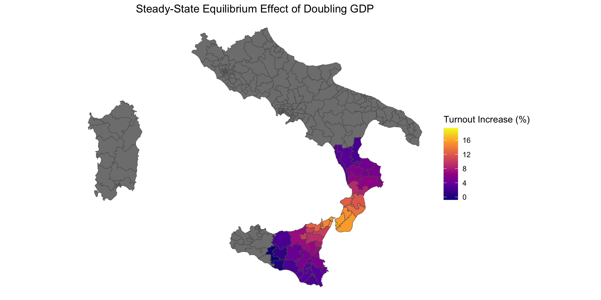
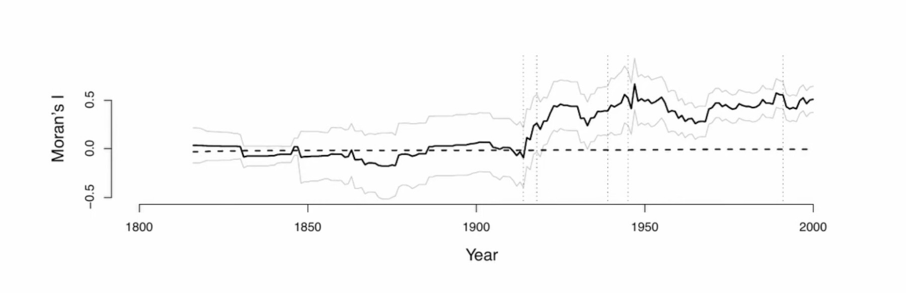

::: {.content-visible unless-format="revealjs"}

<a class="h2" href="./slides.html" target="_blank">Open slides in new tab &rarr;</a>

:::

# Real MF Project Hours!!! {data-stack-name="Final Project"}

* The "MF" is for "Map Fanatic"!

## Final Project Details {.crunch-title}

* **Project Showcase**: 6:30-9pm, Wed, **December 3**, 2025
  * Come eat falafel and show off your cool visualizations and regression coefficients!
* **Reports**: Due 5:59pm, Fri, **December 12**, 2025
  * If you're in DSAN 6000 and you're worried about that final project... See next slide!

<!-- {fig-align="center"} -->

## Due Date Details {.smaller .crunch-title .title-12}

<iframe src="https://calendar.google.com/calendar/embed?height=550&wkst=1&ctz=America%2FNew_York&showPrint=0&src=Y19iMmNhM2I5NTM5MWY1OTk2Zjc0Y2FjMDQ5ZGE1MjZhZDY0YWIwOThmOTc3ZjIwZjQ1YTBiYTVjN2IwMmMxZWIyQGdyb3VwLmNhbGVuZGFyLmdvb2dsZS5jb20&color=%239e69af" style="border:solid 1px #777" width="900" height="550" frameborder="0" scrolling="no"></iframe>

## Presentation Setup

* Each of your desks becomes a **"table"** at a GIS conference!
* Everyone can go around and ask others about projects 😻
* But, **FOOD** $\implies$ you can also stay!

## Report Setup {.crunch-title}

* [**GitHub repository**](https://github.com/) (for your portfolio!)
  * GH Pages site: `your_username.github.io/gis-project`
* ...What do you put in that GitHub repository?
* [**Quarto Manuscript**](https://quarto.org/docs/manuscripts/)
* What do you put in the Quarto manuscript?
* **Writeup** + **Visualizations** + **Code**, interspersed!
  * "Literate Programming" $\Rightarrow$ **Reproducible Results!**

# Spatial Regression {data-stack-name="Spatial Regression"}

* (We made it! This is the last Spatial Data Science topic!)
* (Nearly all extremely-fancy applied GIS models can be implemented via Spatial Regression!)

## Motivation: When Does Non-Spatial Regression "Work"?

$$
Y_i = \beta_0 + \beta_1X_{i,1} + \beta_2X_{i,2} + \cdots + \beta_MX_{i,M} + \varepsilon_i
$$

* Importance of OLS regression: can give us the **Best Linear Unbiased Estimator (BLUE)**
* This is only true **if** the Gauss-Markov assumptions hold---one of these is that the error terms are **uncorrelated**:

  $$
  \text{Cov}[\varepsilon_i, \varepsilon_j] = 0 \; \forall i \neq j
  $$

## Spatial Autocorrelation in Residuals

* We have now seen several models / datasets where effect of some variable $X$ (say, population) on another variable $Y$ (say, disease count) is **spatial**! (Kind of the whole point of the class 😜)
* So, to see when OLS will "work", vs. when you need to incorporate GIS, key step is **plotting the spatial distribution of regression residuals!**

## Example: Italian Elections

:::: {.columns}
::: {.column width="50%"}

{fig-align="center" width="100%"}

:::
::: {.column width="50%"}

{fig-align="center" width="100%"}

:::
::::

## Will OLS "Work" Here? {.smaller}

* Can we use OLS to derive the BLUE of the effect of GDP on voting?

:::: {.columns}
::: {.column width="48%"}

Plain OLS

| $N = 477$ | $\widehat{\beta}$ | SE | $t$ |
| - | - | - | - |
| Intercept | 35.30 | 2.21 | 15.96 |
| Log GDP per cap | 13.46 | 0.65 | 20.84 |

Moran's $I$ for residuals = **0.47**(!)

:::
::: {.column width="4%"}

&nbsp;

:::
::: {.column width="48%"}

Spatial Regression

| $N = 477$ | $\widehat{\beta}$ | SE | $t$ |
| - | - | - | - |
| Intercept | 4.70 | 1.66 | 2.80 |
| Log GDP per cap | 1.77 | 0.48 | 3.66 |
| $\rho$ | 0.87 | 0.02 | 36.7 |

:::
::::

## What Does it Mean that "Spatial Effect" is Significant? {.smaller}

{fig-align="center" width="100%"}

## Case 1: No Residual Spatial Autocorrelation

* Example: Residuals have Moran's $I$ near 0...
* ...Don't need GIS at all!

## Case 2: Conditional Autoregressive Model (CAR)

* GIS, but... only for "fixing" your regression

$$
Y_i = \underbrace{\mu_i}_{\text{Non-spatial model}} + \underbrace{\frac{1}{w_{i,\cdot}}\sum_{j \neq i}(Y_j - \mu_j)}_{\text{Spatial Autocorrelation}} + \varepsilon_i
$$

## Case 3: Simultaneous Autoregressive Model (SAR)

* The main event! Here we are **explicitly** modeling "spatially lagged" versions of our dependent variable $Y$!

$$
Y = \mathbf{X}\beta + \rho \underbrace{\mathbf{W}Y}_{\mathclap{\text{Spatially-lagged }Y}} + \boldsymbol\varepsilon
$$

# Immediately-Relevant Tools for Final Projects! (The Coming Weeks) {.title-09 data-stack-name="Tools Preview"}

* Research Methodology (**Hypotheses**)
* Visualizing Spatial Data
* Weighted Connection Matrices $\mathbf{W}$
* Remote-Sensed / Raster Data
* Data Anonymization / Synthetic Datasets

## Research Methodology: Hypotheses {.crunch-title .crunch-img}

**Social Science (McCourt):**

{width="40%"}

**Machine Learning (DSAN):**

{width="40%"}

## (Secretly My Opportunity to do More Spatial Regression!) {.crunch-title}

* What **explains** previously-observed instances of **separatist insurgencies**?
* Can we **predict** separatist insurgencies?
* One (spatial) idea: **how far away** are [centers of power] from [regions of countervailing power]?
* $X$ = Distance from capital, $Y$ = Insurgency
* Unit of observation: Regions? Insurgent uprisings? Countries?

## Operationalizing {.crunch-ul}

* The variables in previous slide are **conceptual**
* Operationalizing = "Turning into measurable quantities"
* $X$ = MeanDistance(Capital, Insurgent Region), $Y = \mathbf{1}[\text{Insurgency}]$
* Alternative:

$$
Y = \begin{cases}
2 &\text{if Successful Insurgency} \\
1 &\text{if Failed Insurgency} \\
0 &\text{if No Insurgency}
\end{cases}
$$

## Connection Matrices

* `spdep`
* Neighbors if **Centroids** are close
* Neighbors if **Capitals** are close
* 🤔

## Remote-Sensed / Raster Data

* You've seen (to some extent) `terra`
* [`stars`](https://r-spatial.github.io/stars/): Same group behind `sf`
* Google solar panel data
* `.tif` files: Dynamically loaded

## Anonymization / Synthetic Datasets

* Differential privacy
* Used by the US Census(!) Since 2020

## Example: Bolshevik Revolution $\rightarrow$ "Bipolar" World

{fig-align="center"}

* Null hypothesis: no spatial effect of democratization/de-democratization on neighboring countries
* If null hypothesis is true, and countries democratize/de-democratize independently... could this pattern still arise?

## References

::: {#refs}
:::
