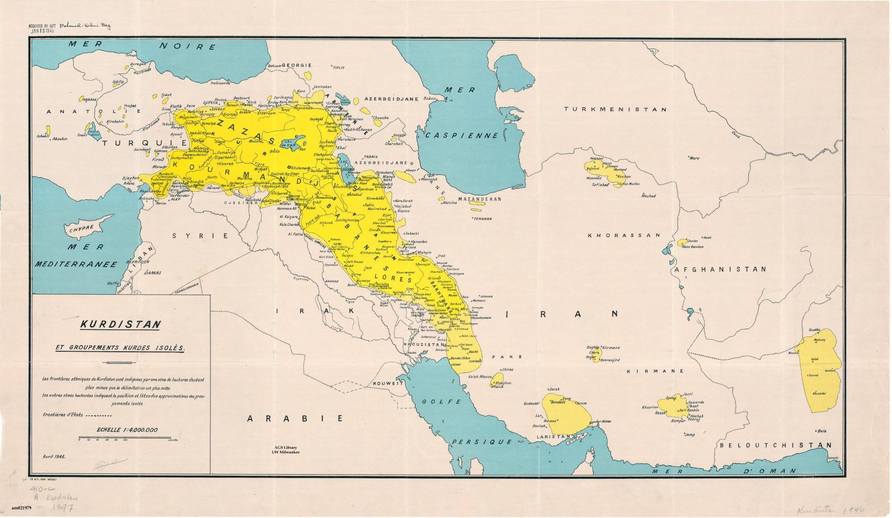

# (1) Overview and Data Loading

## (1.1) Historical Kurdistan Geoms from ESRI

First, check out [this amazing ESRI StoryMap](https://storymaps.arcgis.com/stories/0e0151ceb16741d992ed18edfa5f7909), which we'll cite as @hanson_putting_2023. If you're interested, you can read a bunch more about the modern history of the Kurds in @mcdowall_modern_2021.

For the sake of this assignment, though, we'll focus in on the following 1946 map, which Jeff will give the fuller details of (condensing @mcdowall_modern_2021 into less than 5 minutes, hopefully!) in class:

{.lightbox fig-align="center"}

The gist of where this map comes from can be gleaned by just... starting with UN Security Council Resolution 1, and going forward from there to UNSC Res. 2, Res. 3, and so on (as one does, of course, for learning about International Relations). You won't need to do that for long to get a sense for the early importance of Kurdistan to the drawing of modern, post-WWII borders, since:

* [UNSC Res. 2](https://en.wikipedia.org/wiki/United_Nations_Security_Council_Resolution_2),
* [UNSC Res. 3](https://en.wikipedia.org/wiki/United_Nations_Security_Council_Resolution_3), and
* [UNSC Res. 5](https://en.wikipedia.org/wiki/United_Nations_Security_Council_Resolution_5) (after UNSC Res. 4 condemned Francoist Spain real quick)

all revolved around placing diplomatic pressure on the USSR to withdraw from (soon-to-become) Iranian Kurdistan.

With Kurds thus about to lose their remaining piece of territory that hadn't been absorbed into a postwar nation-state — the independent (USSR-backed) [Kurdish Republic of Mahabad](https://en.wikipedia.org/wiki/Republic_of_Mahabad) — a Kurdish diaspora group meeting in Egypt created this map that same year, as a tool for advocates of a Kurdish nation-state.

## (1.2) From ESRI StoryMaps to `sf` Objects

Digging into the code using Developer Tools reveals the magical **API endpoint**: [https://services.arcgis.com/3xOwF6p0r7IHIjfn/arcgis/rest/services/Kurdistan1947Boundaries](https://services.arcgis.com/3xOwF6p0r7IHIjfn/arcgis/rest/services/Kurdistan1947Boundaries)

We could wrestle with ESRI's API, but, there's an even more fun way, which I learned about via [this blog post](https://jonathanchang.org/blog/downloading-esri-online-shapefiles/). Reading that will lead you on to the [`pyesridump` library](https://github.com/openaddresses/pyesridump), which I use within Python to download the layers of that StoryMap as `.geojson` files.

The details of how `pyesridump` converts ESRI StoryMap **Features** into "standard" WKT **Geometries** can be fun to learn but are a bit outside of the scope of this writeup. But, from the following output you can see that ESRI **Features** can contain the WKT geometry types we've seen (like `POINT`, `LINESTRING`, or `POLYGON`), and in this case the feature we download does indeed correspond to a collection of `POLYGON`s (here we print just its first coordinate):



The remainder of the lab uses these files, along with `rnaturalearth`!

## (1.3) Modern Border Geometries

```{r}
#| label: init
source("fix-mapview-basemap.r")
library(tidyverse) |> suppressPackageStartupMessages()
library(scales) |> suppressPackageStartupMessages()
library(ggarrow) |> suppressPackageStartupMessages()
library(sf) |> suppressPackageStartupMessages()
library(rnaturalearth) |> suppressPackageStartupMessages()
library(mapview) |> suppressPackageStartupMessages()
```

```{r}
#| label: krd-countries
country_list <- c(
  "Turkey",
  "Iran",
  "Iraq",
  "Syria"
)
countries_sf <- rnaturalearth::ne_countries(
  scale=50,
  type="countries",
  country=country_list
)
```

From among allll the variables in `countries_sf`, we're only going to need `geounit` and (later) `pop_est`!

```{r}
#| label: simplify-countries-sf
countries_sf <- countries_sf |>
  select(geounit, pop_est)
countries_map <- mapview(
  countries_sf,
  zcol='geounit'
)
countries_map
```

And now the 1946 `.geojson` file, from the ESRI StoryMap, as discussed above!

```{r}
#| label: add-krd
print(getwd())
if (endsWith(getwd(), "ppol6805")) {
  setwd("./writeups/interpolation/")
}
krd_sf <- sf::st_read("data/krd_46.geojson") |>
  mutate(label="Kurdistan 1946")
```

```{r}
#| label: make-krd-map
krd_map <- mapview(krd_sf, zcol='label')
krd_map
```

```{r}
#| label: display-countries-krd-map
countries_map + krd_map
```

# (2) Areal-Weighted Interpolation for "Division"

## (2.1) Splitting 1946 Kurdistan via `st_filter()`

Intersects as the default predicate... not very helpful here!

```{r}
#| label: krd-regions-filter
default_sf <- countries_sf[krd_sf,]
mapview(default_sf)
```

But, intersect**ion**, via `st_intersection()`, does give us what we want!

```{r}
#| label: krd-intersection
# inter_sf <- st_as_sf(st_union(st_intersection(countries_sf, krd_sf)))
inter_sf <- st_intersection(countries_sf, krd_sf)
# New name column, for labeling the intersections
inter_sf <- inter_sf |> mutate(
  krd_name = paste0(geounit, " Kurdistan")
)
mapview(inter_sf, label="krd_name")
```

## (2.2) The Four Pieces

Now let's view the four rows of the `sf` object individually:

```{r}
#| label: view-turkish-krd
mapview(inter_sf[1,], zcol='krd_name')
```

```{r}
#| label: view-syrian-krd
mapview(inter_sf[2,], zcol='krd_name')
```

```{r}
#| label: view-iraqi-krd
mapview(inter_sf[3,], zcol='krd_name')
```

```{r}
#| label: view-iranian-krd
mapview(inter_sf[4,], zcol='krd_name')
```

...and all at once:

```{r}
#| label: view-all-intersections
mapview(inter_sf, zcol='krd_name')
```

Very cool, but, we haven't taken **population** into account at all, which was the whole point of this exercise... spatial join / interpolation time!

## (2.3) Spatial Join / Interpolation

Again drawing on @mcdowall_modern_2021 (this table is on page 4), we can estimate that the overall population across the four modern countries is approximately **32 million**:

| Country   | % of Country | Count       |
|-----------|-------------:|:------------|
| Turkey    | 18           | 15 million  |
| Iran      | 10           | 8 million   |
| Iraq      | 18           | 7.2 million |
| Syria     | 9            | 1.8 million |
| Diaspora  | -            | 2 million   |
| **Total** | -            | 34 million  |

So, given this estimate, we can now "start over", this time with the goal of keeping track of the **population** as we do our operations:

```{r}
#| label: view-krd-with-pop
fmt_pop <- function(x) formatC(x,big.mark=",",format='d')
krd_sf <- krd_sf |> mutate(
  pop = 32000000,
  pop_str = fmt_pop(pop)
)
mapview(krd_sf, zcol='pop_str')
```

Now, if we just use `st_intersection()`... it doesn't know that it should pay attention to `pop` (even if it did know that, it wouldn't know exactly how you want to split it up... we'll get there)

```{r}
#| label: krd-naive-intersection
pop_intersected_sf <- st_intersection(countries_sf, krd_sf) |>
  mutate(
    pop_str = fmt_pop(pop),
    map_label = paste0(geounit, ': ', pop_str)
  )
mapview(pop_intersected_sf, zcol='pop', label='map_label')
```

So... what do we do? The binary operations we've learned so far won't cut it, sadly.

So, we need to cap off the binary operations portion of the class with the fanciest operation we'll need: **spatial joins**, though more specifically we'll want an **interpolation**. The function in `sf` is called `st_interpolate_aw()`.

Let's add that to our toolkit and get to **spatial statistics/data science!**

```{r}
#| label: interpolate-sf
pop_interpolated_sf <- st_interpolate_aw(
  krd_sf['pop'],
  countries_sf,
  extensive=TRUE
)
pop_interpolated_sf
```

And let's visualize it!

```{r}
#| label: interpolate-sf-mapview
pop_interpolated_sf <- pop_interpolated_sf |> mutate(
  pop_rounded = round(pop, 0),
  pop_str = fmt_pop(pop_rounded)
)
mapview(pop_interpolated_sf, zcol='pop', label='pop_str')
```

Cool, this tells us, if we **didn't** create a Kurdistan, and just drew the borders of the four states without concern for this community (hypothetically.......), how many Kurds would be in each country (again, **assuming *uniform* distribution across 1946 Kurdistan!**)

Since we know the **total** population of 1946 Kurdistan, it would be a bad sign for the method if the **sum** of the four inferred populations didn't equal this total! Let's check:

```{r}
#| label: check-pop-sum
pop_interpolated_sf
pop_interpolated_sf$pop |> sum() |> fmt_pop()
```

Great! `st_interpolate_aw()` has perfectly "chopped" the total of 32 million into 4 sub-populations $p_1$, $p_2$, $p_3$, and $p_4$, where:

* The **fraction of the 32 million people** estimated to be in territory $p_i$...
* Is equal to the **fraction of the overall Kurdistan area** that is **within country $i$**

## (2.4) Now Interpolating Over the *Intersection*

I think of the above as kind of a... "partially-spatially-aware" interpolation. This isn't a great description, but, what I'm getting at is the fact that:

* It *does* successfully compute how our population (of 1947 Kurdistan) proportionally distributes across the four national borders, but
* It then *represents the output*, *geometrically* (as in, the `geometry` column), as just the original four countries, now with an additional **non-spatial** property: the Kurdish population in that country

So, for what I'll call a "fully-spatially-aware" interpolation, we'll combine the two things we figured out above:

* Spatial **intersection** between 1947 Kurdistan and the four countries (producing Turkish, Iranian, Syrian, and Iraqi Kurdistan), plus
* The areal-weighted **interpolation** we just did above

And it turns out, all that we really need to change is **which `sf` object** we're spatially interpolating across! Meaning, this is the above code, copied-and-pasted, with `countries_sf` now replaced by `inter_sf`:

```{r}
#| label: fully-spatially-aware
fully_joined_sf <- st_interpolate_aw(
  krd_sf['pop'],
  inter_sf,
  extensive=TRUE
)
mapview(fully_joined_sf)
```

Also take note of something here: how did `mapview` "know" to color the four regions by population (using the viridis scheme, the default in `mapview`!), when we didn't specify anything for the `zcol` argument?

This happens because, `st_interpolate_aw()` is solely dedicated to computing a **single piece of information**: the population that results from distributing the first argument (numeric) across the second argument (an `sf`, with a `geometry` column)! It's technically not intended to carry out a full-on join.

So, if you find yourself needing to keep **all the other information** along with the new areal-weighted population (which will usually be the case), just make sure you **add the new areal-weighted population column in `fully_joined_sf`** back into the `sf` object you passed as the second argument to `st_interpolate_aw()`, as a **new column**:

```{r}
#| label: interpolate-as-join
inter_sf <- inter_sf |> mutate(
  pop_interpolated = fully_joined_sf$pop
)
inter_sf
```

And now we can use all the other info, like the name, for the rest of our analysis! For example, when making an interactive map!

```{r}
#| label: interpolated-final
inter_sf <- inter_sf |> mutate(
  krd_name = paste0(geounit, ' Kurdistan'),
  pop_str = fmt_pop(pop_interpolated),
  krd_label = paste0(krd_name, ': ', pop_str)
)
mapview(inter_sf, zcol='pop_interpolated', label='krd_label')
```

## (2.5) How Did We Do?

If we only care about the GIS methodology in and of itself (learning how to perform these areal weighted interpolations), we'd move on to the next section here...

But, since the point of learning this is to *accomplish* something — the geographically-aware estimation of these sub-populations — let's see how we did! (Remember, if the estimates are "bad", it doesn't mean the method itself is faulty — it means that the **assumptions made by the method** are **violated** to a significant extent in **this particular case**)

We can take the population estimates from @mcdowall_modern_2021, given in the table above, and compare them with the interpolation-derived populations:

```{r}
#| label: compare-estimates
mcdowall_df <- tibble::tribble(
  ~geounit, ~pop_mcdowall,
  "Turkey", 15000000,
  "Iran", 8000000,
  "Iraq", 7200000,
  "Syria", 2000000,
)
pop_est_sf <- inter_sf |>
  left_join(mcdowall_df) |>
  select(geounit, pop_mcdowall, pop_interpolated) |>
  mutate(pop_diff=pop_interpolated - pop_mcdowall)
```

```{r}
#| label: plot-estimates-numeric
ggplot() +
  # You can get more "basic" arrows using Base R functions
  # like this, if you don't want to deal with ggarrow
  # geom_segment(
  #   data=pop_est_sf,
  #   mapping=aes(
  #     x=pop_mcdowall, xend=pop_interpolated, y=geounit
  #   ),
  #   arrow=arrow(length = unit(0.25, "cm"))
  # ) +
  geom_arrow_segment(
    data=pop_est_sf,
    mapping=aes(
      x=pop_mcdowall,
      xend=pop_interpolated,
      y=geounit
    ),
    resect_head=1, resect_fins=0,
    linewidth=0.8
  ) +
  geom_point(
    data=pop_est_sf,
    mapping=aes(
      x=pop_mcdowall,
      y=geounit,
      color='mcd'
    ),
    size=3
  ) +
  geom_point(
    data=pop_est_sf,
    mapping=aes(
      x=pop_interpolated,
      y=geounit,
      color='interp'
    ),
    size=2.5
  ) +
  theme_classic(base_size=11) +
  theme(plot.title=element_text(hjust=0.5)) +
  scale_x_continuous(labels = label_comma()) +
  scale_color_manual(
    labels=c(
      "mcd"="McDowall (2021)",
      "interp"="Interpolated"
    ),
    values=c(
      "mcd"="black",
      "interp"="#e69f00"
    )
  ) +
  labs(
    x="Population",
    title="True vs. Interpolated Populations"
  )
```

And we can plot the residuals on the map, to visualize where exactly our method over- and under-estimated:

```{r}
#| label: krd-residuals
mapview(pop_est_sf, zcol="pop_diff")
```

This brings up one important data-visualization point, however: when you have values that **diverge from zero** like this, you almost always want your color palette to reflect the zero point, which `mapview` currently fails to do! So, this is a point where we might break out `ggplot2`, which has significantly more functionality for this (as a full visualization "grammar"):

```{r}
#| label: krd-residuals-ggplot
pop_est_sf |> ggplot(aes(fill=pop_diff)) +
  geom_sf() +
  scale_fill_gradient2(
    low="#4b0055", mid="white", high="#fde333",
    labels=label_comma()
  ) +
  theme_classic(base_size=12) +
  theme(plot.title=element_text(hjust=0.5)) +
  labs(
    title="Population Estimates: (Interpolated - True)"
  )
```

# (3) Areal-Weighted Interpolation as "Aggregation": Estimating *Kurdistan* Population from Country Populations

Here, we pretend we don't know the population of Kurdistan, and try to **estimate it** from the four country populations, based on how much of each country `POLYGON`s **overlap** with the Kurdistan `POLYGON`:

```{r}
#| label: country-pops
countries_sf
```

Visualized:

```{r}
#| label: country-pops-map
countries_sf <- countries_sf |> mutate(
  pop_str = fmt_pop(pop_est),
  pop_label = paste0(geounit, ": ", pop_str)
)
mapview(countries_sf, zcol="pop_est", label="pop_label") + krd_map
```

```{r}
#| label: interpolated-pop
krd_pop_est_sf <- st_interpolate_aw(
  countries_sf['pop_est'],
  krd_sf,
  extensive = TRUE
)
krd_sf <- krd_sf |> mutate(
  pop_est = krd_pop_est_sf$pop_est,
  pop_str = fmt_pop(pop_est),
  geounit = "Kurdistan",
  pop_label = paste0("Kurdistan Est: ", pop_str)
)
krd_sf
```

And, visualized!

```{r}
#| label: krd-est-pop-map
mapview(countries_sf, zcol="pop_est", label="pop_label") + mapview(krd_sf, zcol="pop_est", label="pop_label")
```

We can also just combine our estimated Kurdistan data with the country data into one, big `sf` object with **5 rows**, where we just have to keep in mind that we've technically changed the **unit of observation** in each row from "UN-recognized country" to essentially "Geopolitical entity of some sort"

```{r}
krd_sub_sf <- krd_sf |> select(
  geounit, pop_est, pop_str, pop_label
)
pol_ent_sf <- rbind(countries_sf, krd_sub_sf)
pol_ent_sf
```

And now, with a single `mapview` call:

```{r}
#| label: visualize-combined
mapview(pol_ent_sf, zcol='pop_est', label='pop_label')
```

# (4) Calibrating Two *Grids*

There is a "Northern" Kurdish language, Kurmanji, as well as a "Central" Kurdish language called Sorani^[There is also a "Southern" Kurdish language called [Xwarin](https://en.wikipedia.org/wiki/Southern_Kurdish)] While it's a bit difficult (though, very possible!) to get **`POLYGON`s** for language groups, there are standardized datasets like [Glottolog](https://glottolog.org/resource/languoid/id/cent1972.bigmap.html#4/35.65/45.81) and [WALS](https://wals.info/languoid/lect/wals_code_kji) that we can use to get at least the **centroid** of where the language is spoken, as a `POINT`:

```{r}
#| label: lang-centroids
kl_df <- tibble::tribble(
  ~name, ~lat, ~lon,
  # "Northern" Kurdish language: Kurmanji
  "Kurmanji Centroid", 37.00, 43.00,
  # "Central" Kurdish language: Sorani
  "Sorani Centroid", 35.65, 45.81
)
# sf for language centroids
kl_cent_sf <- st_as_sf(
  kl_df,
  coords=c('lon','lat'),
  crs=4326
)
(cent_map <- mapview(kl_cent_sf))
```

So, let's use **Voronoi tessellation** to split Kurdistan into two sections, based on whether each point is closer to the **Kurmanji** or **Sorani** centroid!

```{r}
#| label: lang-centroids-voronoi
krd_voronoi <- st_voronoi(
  st_union(kl_cent_sf),
  envelope=st_as_sfc(st_bbox(krd_sf))
)
krd_extracted <- st_collection_extract(krd_voronoi, "POLYGON")
#mapview(krd_extracted)

krd_inter_sf <- st_sf(geometry = krd_extracted) |>
  st_intersection(krd_sf)
krd_inter_sf$label <- c("Kurmanji Speakers", "Sorani Speakers")
mapview(krd_inter_sf, zcol='label') + cent_map
```

So now our job becomes: can we re-do the above estimate of Kurdistan's population, but this time derive **two separate estimates**, where the original estimate is "chopped" into two pieces on the basis of the distribution of area between Kurmanji and Sorani...

The answer is: yes! That's also the job of `st_interpolate_aw()` 😎

```{r}
#| label: lang-centroids-interpolate
lang_pop_sf <- st_interpolate_aw(
  countries_sf['pop_est'],
  krd_inter_sf,
  extensive=TRUE
)
mapview(lang_pop_sf)
```

And, adding back into our `krd_inter_sf` object so we have all the data "carried over":

```{r}
#| label: interpolate-with-attributes
krd_inter_sf <- krd_inter_sf |> mutate(
  pop_est = lang_pop_sf$pop_est,
  pop_str = fmt_pop(pop_est),
  pop_label = paste0(label, ": ", pop_str)
)
mapview(krd_inter_sf, zcol='pop_est', label='pop_label')
```

Wohoo! Once again, we can confirm that this process of "superimposing" one grid onto another has preserved **total** population:

```{r}
#| label: check-interp-sum
krd_inter_sf
krd_inter_sf$pop_est |> sum() |> fmt_pop()
```

It *nearly* matches our interpolated population estimate from before — it is off by about 1000 people. This is likely just the result of our Voronoi tesselation being an approximate (as in, not infinitely pixel-perfect) algorithm, run on an approximate geographic area (the 10-scale `rnaturalearth` `POLYGON`s). If we ran it with a more detailed map, and had it run for more iterations, it would likely converge to the exact sum we're looking for!
